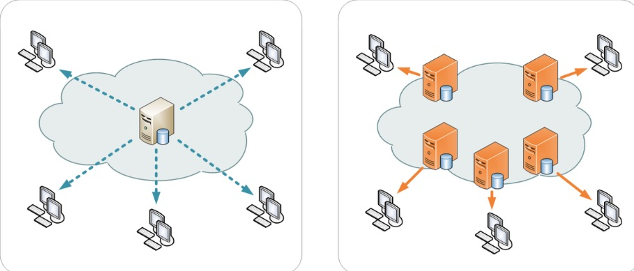

# TCP 三次握手🤝与四次挥手🙋‍♂️

上文介绍了 dns 解析，在DNS域名解析后，获取到了服务器的IP地址，在获取到IP地址后，便会开始建立一次连接，这是由TCP协议完成的，主要通过三次握手进行连接

 **封装与解封的过程**：类比洋葱（洋葱的心就是我们要发送的数据）到达接收端要一层一层的剥开，也可以类比网购买东西-买家包装-快递打包-快递车（这里类比物理层）-到达目的地-先卸货-打开快递包-最后拆开包装才能看见我们购买的物品

**Tcp 协议模型详解**:

下面是 **七层模型**，由于 表示层 和会话层没有对应的协议经常并入应用层得到 **五层模型**

* Source Port：源端口，Destination Port：目的端口
* Sequence number：顺序号（发送端发给接收端的），为什么需要顺序号，网络数据再网络上面传输时是分为不同的多个小包来传递的，第一个和第二个以至于后续的小包传递的路径和速度都是不同的，所以接收方接收到的小包是没有顺序的，这个顺序号就是保证数据的有序性的，接收方会按照接收到的小包的顺序号来组装数据，如果发生丢包的情况，接收端会给发送端发送一个信号（某某某顺序号的包我没有收到，这个时候发送方就会从新发送该包）
  * Sequence number的意义就在与第一：服务器能按照顺序号来组装数据，第二：有重发机制(从发送时Sequence number是相同的)
* Acknowledgment Number: 应答号
* 在整个过程中Sequence number 和 Acknowledgment Number是逐渐增加的，不能跳也不能减的

* 三次🤝四次🙋过程
* 为什么要三次握手：是为了保证可靠性
* 半链接：一方认为链接🔗还在，一方认为🔗已经断开了，半链接同样会导致资源浪费（认为🔗还在的那一端就得去维护这个🔗，虽然有一个🔗超时的这么一个机制（认为一个🔗在多少秒内没有发生数据传输就认为是已经关闭），这个时间一般比较长，但是还是会导致浪费资源）可以通过原始套接字去实现半链接，有一种攻击就是半🔗攻击，在短时间内发生大量的请求给服务器，然后就不管了不给服务器响应
* 四次挥手：不管是建立🔗还是断开🔗一般情况下都是客户端发起的，服务器就在那等着，在特殊情况下如（超时）服务器可以主动断开🔗
  * 客户的说：我想要断开🔗了，服务器第一次回应（我知道了，我看看我这里还有没有什么没有处理完的事情），服务器第二次回应（我这里也没什么事情了，可以断开了），客户断在发一个响应回去（也就是双方都要确认对方把工作都给做完了，才能断开）

* 【问题1】为什么连接的时候是三次握手，关闭的时候却是四次握手？

  答：因为当Server端收到Client端的SYN连接请求报文后，可以直接发送SYN+ACK报文。其中ACK报文是用来应答的，SYN报文是用来同步的。但是关闭连接时，当Server端收到FIN报文时，很可能并不会立即关闭SOCKET，所以只能先回复一个ACK报文，告诉Client端，"你发的FIN报文我收到了"。只有等到我Server端所有的报文都发送完了，我才能发送FIN报文，因此不能一起发送。故需要四步握手。

* 【问题2】为什么不能用两次握手进行连接？

  答：现在把三次握手改成仅需要两次握手，死锁是可能发生的。作为例子，考虑计算机S和C之间的通信，假定C给S发送一个连接请求分组，S收到了这个分组，并发 送了确认应答分组。按照两次握手的协定，S认为连接已经成功地建立了，可以开始发送数据分组。可是，C在S的应答分组在传输中被丢失的情况下，将不知道S 是否已准备好，不知道S建立什么样的序列号，C甚至怀疑S是否收到自己的连接请求分组。在这种情况下，C认为连接还未建立成功，将忽略S发来的任何数据分 组，只等待连接确认应答分组。而S在发出的分组超时后，重复发送同样的分组。这样就形成了死锁。

* 【问题3】如果已经建立了连接，但是客户端突然出现故障了怎么办？

  TCP还设有一个保活计时器，显然，客户端如果出现故障，服务器不能一直等下去，白白浪费资源。服务器每收到一次客户端的请求后都会重新复位这个计时器，时间通常是设置为2小时，若两小时还没有收到客户端的任何数据，服务器就会发送一个探测报文段，以后每隔75秒钟发送一次。若一连发送10个探测报文仍然没反应，服务器就认为客户端出了故障，接着就关闭连接。

* 【问题4】为什么TIME_WAIT状态需要经过2MSL(最大报文段生存时间)才能返回到CLOSE状态？

  答：虽然按道理，四个报文都发送完毕，我们可以直接进入CLOSE状态了，但是我们必须假想网络是不可靠的，有可能最后一个ACK丢失。所以TIME_WAIT状态就是用来重发可能丢失的ACK报文。在Client发送出最后的ACK回复，但该ACK可能丢失。Server如果没有收到ACK，将不断重复发送FIN片段。所以Client不能立即关闭，它必须确认Server接收到了该ACK。Client会在发送出ACK之后进入到TIME_WAIT状态。Client会设置一个计时器，等待2MSL的时间。如果在该时间内再次收到FIN，那么Client会重发ACK并再次等待2MSL。所谓的2MSL是两倍的MSL(Maximum Segment Lifetime)。MSL指一个片段在网络中最大的存活时间，2MSL就是一个发送和一个回复所需的最大时间。如果直到2MSL，Client都没有再次收到FIN，那么Client推断ACK已经被成功接收，则结束TCP连接。

#### CDN

> CDN的全称是Content Delivery Network，即[内容分发网络]。CDN是构建在网络之上的内容分发网络，依靠部署在各地的**边缘服务器**，通过**中心平台**的**负载均衡、内容分发、调度**等功能模块，使用户就近获取所需内容，降低网络拥塞，提高用户访问响应速度和命中率。CDN的关键技术主要有内容存储和分发技术。

