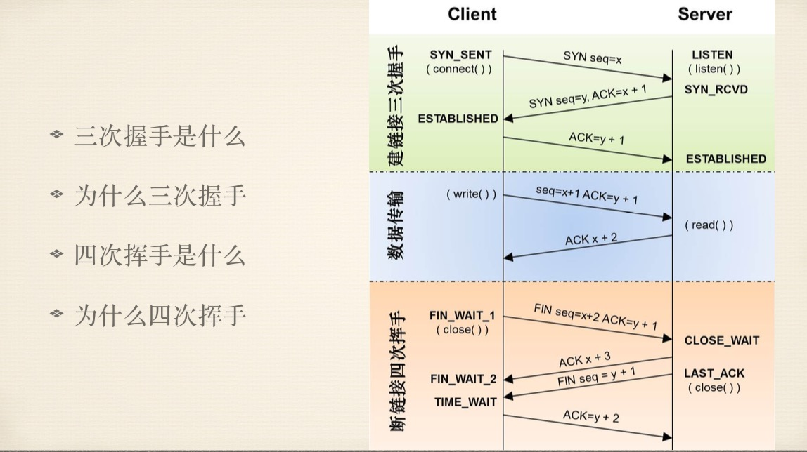

# TCP 三次握手🤝与四次挥手🙋‍♂️

上文介绍了 dns 解析，在DNS域名解析后，获取到了服务器的IP地址，在获取到IP地址后，便会开始建立一次连接，这是由TCP协议完成的，主要通过三次握手进行连接

 **封装与解封的过程**：类比洋葱（洋葱的心就是我们要发送的数据）到达接收端要一层一层的剥开，也可以类比网购买东西-买家包装-快递打包-快递车（这里类比物理层）-到达目的地-先卸货-打开快递包-最后拆开包装才能看见我们购买的物品

**Tcp 协议模型详解**:

下面是 **七层模型**，由于 表示层 和会话层没有对应的协议经常并入应用层得到 **五层模型**

* Source Port：源端口，Destination Port：目的端口
* Sequence number：顺序号（发送端发给接收端的），为什么需要顺序号，网络数据再网络上面传输时是分为不同的多个小包来传递的，第一个和第二个以至于后续的小包传递的路径和速度都是不同的，所以接收方接收到的小包是没有顺序的，这个顺序号就是保证数据的有序性的，接收方会按照接收到的小包的顺序号来组装数据，如果发生丢包的情况，接收端会给发送端发送一个信号（某某某顺序号的包我没有收到，这个时候发送方就会从新发送该包）
  * Sequence number的意义就在与第一：服务器能按照顺序号来组装数据，第二：有重发机制
* Acknowledgment Number: 应答号
* 在整个过程中Sequence number 和 Acknowledgment Number是逐渐增加的，不能跳也不能减的

* 三次🤝四次🙋过程

