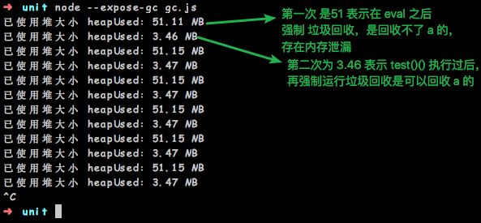
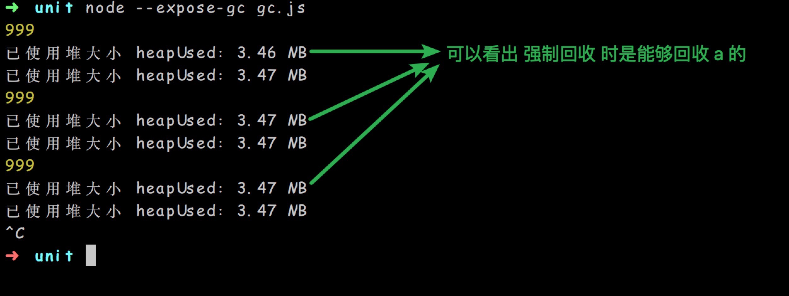

# Js 中的内存泄漏-基于`Node.js`环境

### 测试内存泄漏前的准备

* 为了能够测试内存是否泄漏，我们需要在`node`环境以及在浏览器环境进行验证，本文仅描述`node`环境

* `node` 中查看内存的方式： `process.memoryUsage();`会得到以下一个对象，单位为 `byte`
* `util.inspect()`方法用于将对象序列化为字符串
  * `rss（resident set size）`：所有内存占用，包括指令区和堆栈。
  * `heapTotal`："堆"占用的内存，包括用到的和没用到的。
  * `heapUsed`：用到的堆的部分。
  * `external`： `V8` 引擎内部的 `C++` 对象占用的内存。

```javascript
 { 
  rss: 20668416,       //常驻内存部分
  heapTotal: 6537216,  //堆的总大小
  heapUsed: 3815168,   //已使用堆大小
  external: 8272   
  //external refers to the memory usage of C++ objects bound to JavaScript objects managed by V8
  }
```

#### eval() 会导致内存泄漏 

`window.eval()` 不会泄漏

```javascript
//封一个显示内存的函数
let showMem = function() {
  var format = function(bytes){
    return (bytes / 1024 / 1024).toFixed(2) + ' MB';
  };
  var mem = process.memoryUsage(); // 获取内存使用情况 
  console.log('已使用堆大小 heapUsed：' + format(mem.heapUsed));
}

global.a = 999;
function test() {
  var a = [];
  for (var i = 0; i < 50; i++) {
    a[i] = new Array(1000000).join('*');
  }
  return function() {
    eval("");
    //(new Function("console.log(a);"))();
    try{global.gc();}catch(e){
      console.log("手动垃圾回收失败！");
    }
    showMem();
  }
}

global.gc();//强制gc
setInterval(function() {
  test()();
  try{global.gc();}catch(e){
    console.log("手动垃圾回收失败！");
  }
  showMem();
}, 2000);
```
以上代码的结果：



#### with 会导致内存泄漏 

* 将上面的代码 `return`部门替换为以下

```javascript
  return function() {
    //eval("");
    //(new Function("console.log(a);"))();
    with(obj) {

    }
    try{global.gc();}catch(e){
      console.log("手动垃圾回收失败！");
    }
    showMem();
  }
```


#### new Function 不会泄漏
因为 `new Function` 会跑到全局去，在node环境就是 `blogal`
```javascript
//封一个显示内存的函数
let showMem = function() {
  var format = function(bytes){
    return (bytes / 1024 / 1024).toFixed(2) + ' MB';
  };
  var mem = process.memoryUsage(); // 获取内存使用情况 
  console.log('已使用堆大小 heapUsed：' + format(mem.heapUsed));
}

global.a = 999;
function test() {
  var a = [];
  for (var i = 0; i < 50; i++) {
    a[i] = new Array(1000000).join('*');
  }
  return function() {
    //eval("");
    (new Function("console.log(a);"))();
    try{global.gc();}catch(e){
      console.log("手动垃圾回收失败！");
    }
    showMem();
  }
}

global.gc();//强制gc
setInterval(function() {
  test()();
  try{global.gc();}catch(e){
    console.log("手动垃圾回收失败！");
  }
  showMem();
}, 2000);
```
以上代码结果：



#### try catch  try里面是可以回收的，但是不会回收到catch

```javascript

//封一个显示内存的函数
let showMem = function() {
    var format = function(bytes){
      return (bytes / 1024 / 1024).toFixed(2) + ' MB';
    };
    var mem = process.memoryUsage(); // 获取内存使用情况 
    console.log('已使用堆大小 heapUsed：' + format(mem.heapUsed));
  }
  
  function test() {
    let a = [];
    for (var i = 0; i < 50; i++) {
      a[i] = new Array(1000000).join('*');
    }
    let s = {a};
    return function() {
      //eval("");
      //with(s){};
      try{
        throw(a);
      }catch(err){
          
      }
      try{global.gc();}catch(e){
        console.log("手动垃圾回收失败！");
      }
      showMem();
    }
  }
  
  global.gc();//强制gc
  setInterval(function() {
    test()();
    try{global.gc();}catch(e){
      console.log("手动垃圾回收失败！");
    }
    showMem();
  }, 2000);
```


很明显，如果将 `test`函数换成以下也是会被回收的，毕竟什么都没有做：
```javascript
function test() {
  var a = [];
  for (var i = 0; i < 50; i++) {
    a[i] = new Array(1000000).join('*');
  }
  return function() {
    //eval("");
    //(new Function("console.log(a);"))();
    try{global.gc();}catch(e){
      console.log("手动垃圾回收失败！");
    }
    showMem();
  }
}
```

