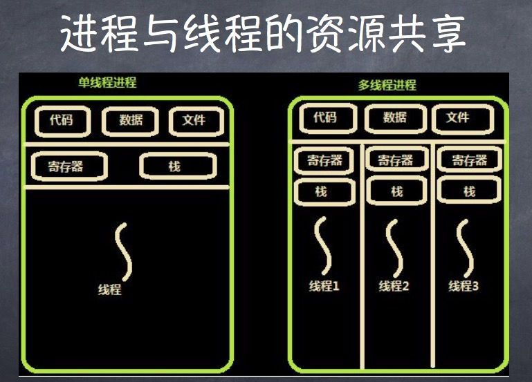
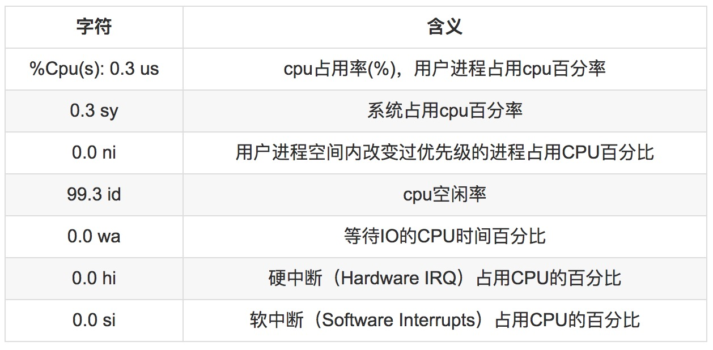
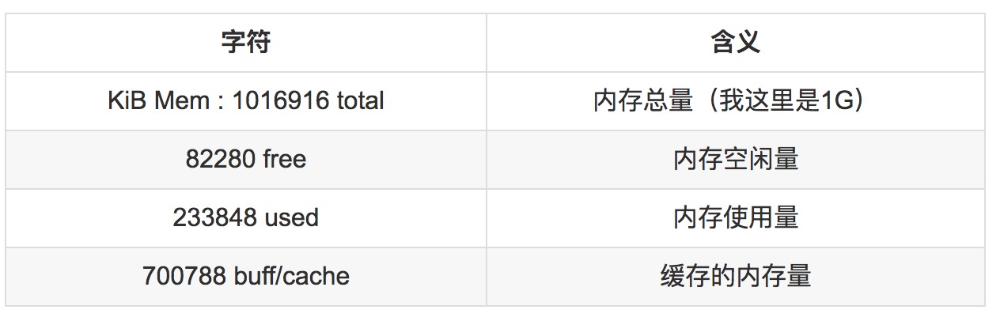
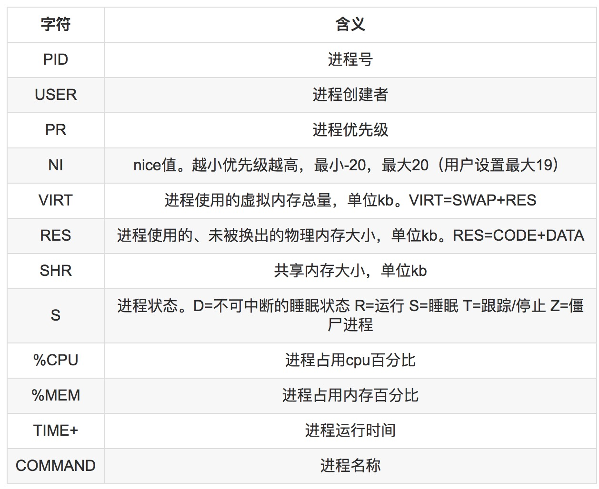
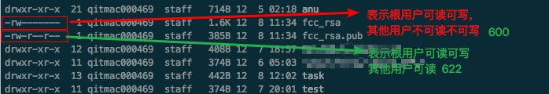
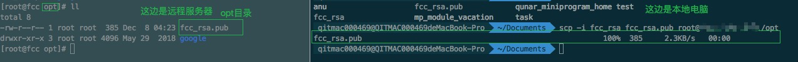

# Linux basic 

### `windows` 终端

* `putty`
* `cmder`(强烈推荐)，超级终端，相当于给 `windows` 加了一个 `shell` 安装的时候安装full版本，安装后就可以在 `windows`、下像 `mac` 和 `Linux`、 一样的用了
* `Xshell` 安装教育学生版本

### `Mac` 终端

* 安装 `iterm2` 

### 远程登录命令

* `ssh`
*  比如：`ssh root@xxx.xxx.xxx.xxx`,会提升输入密码，这个时候的秘密是不回显的
### 修改 `hostname`
* 可以帮助我们区别我们究竟在哪个地方：是在哪一个服务器，是服务器还是本地
* `hostnamectl` 什么参数都不加，就会显示该主机的一些信息
* `hostnamectl -h` 就会列出参数选项
* `hostnamectl set-hostname xxx` 就可以改主机名了，可以带下划线和中划线，改完之后需要退出终端从新登陆才会生效 ，通过 `exit` 就可以退出了
### 常用 `Linux` 命令
* `vi` 行编辑器，`i` 进入编辑状态，`esc` 退出编辑状态进入命令状态，`:wq` 保存退出 ，`:q!` 放弃修改并退出，`:w` 只保存不退出 加上 `sudo` 提升权限
  * 在 `vi` 里面 编辑的时候是不是很方便的，鼠标时不管用的
* 服务管理命令：`systemctl`
  * 直接输入 `systemctl` 命令，会列出在这台机器上面的所有服务，这个时候 按下 `q` 就退出列表状态
  * 比如启动 `mysql` 服务：`systemctl start mysqld`
  * 启动`apache` 服务： `systemctl start httpd`
  * 启动 `nginx` 服务：`systemctl start nginx`
  * `systemctl`的子命令： `restart` 是 重启， `stop` 是停止，`disable` 禁用服务（随着操作系统启动时不会启动），`enable` 启用服务（随着操作系统启动就会启动），`disable  enable` 是不影响 `start stop restart`的
  * 可以发现：有些进程名字后面带个 `d`，这是守护进程的意思

* 命令行下载命令
  * `curl` 比如`curl http://www.baidu.com` 不会下载，只会显示内容，要下载必须指定输出文件名：`curl http://www.baidu.com -o xxx.index`
  * `wget` 比如去下载百度的首页： `wget http://www.baidu.com`
  * `wget` 一般下载就够用了，但是 `curl`很强大，可以用来调试协议请求等，可以`curl -h`查看简单的帮助，用`man curl`可以查看详细的帮助

* 终端快捷键
  * `ctrl + s` 暂停屏幕输出
  * `ctrl + q` 恢复屏幕输出
  * `ctrl + c`终止当前前台正在执行的进程（前台进程也就是占用终端的进程，不能终止守护进程）
  * `ctrl + d`结束输入或者退出 `shell`
  * `ctrl + l` 清屏，相当于 `clear`
  * `ctrl + a`、`ctrl + e` 快速移动光标到行首、行尾，如果安装了`iterm2` 好像可以 用`alt + 左右箭头`
### 进程、线程、协程
* 进程的目的就是担当分配系统资源（`cpu`时间、内存）的实体
  * 注意和 程序 的区别，我们启动一个程序就会变成 进程
  * 程序是静态的可执行文件，一旦程序运行起来了， 进程（动态的）就跟着出现了
  * 服务也是进程，一般用守护进程来跑，不占用终端
  * **普通进程**会占用终端，终端退出时普通进程会退出，**守护进程**是在后台跑的不占用终端，退出终端时不会停

* 线程是操作系统能够进行运算调度的最小单位，一个进程下面可以有多个线程（小任务）

* 协程是一种用户态的轻量级线程，无法利用多核资源

* `IO` 密集型应用的发展：多进程 -> 多线程 -> 事件驱动 -> 协程

* `CPU` 密集型应用的发展： 多进程 -> 多线程

* 调度和切换的时间成本：进程 > 线程 > 协程

* 有时候一个程序可能会占用多个`pid`，杀进程的时候，要杀主进程（父进程，标志为`master`的为主进程，标志为 `worker`的就不是），如果没有发现标志就杀`pid`小的（一般来说小的就是主进程），在 `linux` 里父子进程是一个依赖关系，一旦父进程杀掉了，下面的子进程就也就被杀了

* `ps aux`可以看进程，`s`状态表示休眠状态，**僵尸进程** ：`Z`，程序退出了，进程还在内存里面，**孤儿进程**：父进程已经退出了子进程任然在内存里面留着

* 如何判断是否 僵尸进程 和 孤儿进程，`pid` ` ppid`，如果发现一个进程的 `ppid` 没有，就是孤儿进程，所有的正常进程（除了1号进程没有父进程）其他的进程都是有父进程的

* 单核的情况下，频繁的切换进程和线程时会占用资源的，多核的情况，我们可以一个进程占用一个核，不用切换

  * `cqu` 的优势是整数运算，`gpu` 的优势时浮点数运算，挖矿就是 浮点数运算
* 在操作系统中有三条：
  * **多进程形式**
  * **多线程形式**
  * **协调机制** 一方面可以防止进程和线程之间产生冲突：**内存共享**  ** io独占**，另一方面有允许进程和线程之间资源共享
* 进程与线程的资源共享： 每一个进程都有其单独的一份：代码、数据、文件、寄存器、栈 、线程。然而多线程进程：代码、数据、文件时共享的：

### `Linux` 进程管理相关命令
* `top` 命令
  * `top`命令是`Linux`下常用的性能分析工具，能够实时显示系统中各个进程的资源占用状况，类似于`Windows`的任务管理器。
  * `top`是一个动态显示过程,即可以通过用户按键来不断刷新当前状态.如果在前台执行该命令,它将独占前台,直到用户终止该程序为止
  * 第一行：当前系统时间、系统已运行时间、在线用户、系统负载。三个数值分别为 1分钟、5分钟、15分钟前到现在的平均值
  * 第二行：总进程数、正在运行的进程数、正在睡眠的进程数、停止的进程数、僵尸进程数
  * 第三行：是关于 `cpu`的使用情况
    
  * 第四行：内存使用率
    
  * 第五行：交换区总量、交换区空闲量、交换区使用量
    
  * 在进入top后使用
    * P：以占据CPU百分比排序
    * M：以占据内存百分比排序
    * T：以累积占用CPU时间排序
    * q：退出命令：按q键退出top查看页面
    * s：修改刷新时间间隔。按下s键，然后按下数字，即可修改刷新时间间隔为你输入的数字，单位为秒。例如：按下s键，在按数字1键，即可实现每秒刷新一次
    * k：终止指定的进程。按下k键-->再输入要杀死的进程的pid-->按enter键-->(选择信号类型，以数字标示，默认15为杀死)本步可省略按enter键（常用为-9）

* `ps` 命令

  * `ps` 为我们提供了进程的一次性的查看(快照)，它所提供的查看结果并不动态连续的；如果想对进程动态监控，应该用 `top`

  * `linux` 上进程有 5 种状态

    * D 不可中断 uninterruptible sleep (usually IO) 
    * R 运行 runnable (on run queue) 

    * S 中断 sleeping（睡眠状态） 

    * T 停止 traced or stopped 

    * Z 僵死 a defunct (”zombie”) process（僵尸进程） 

  * 常用的 `ps aux`

* `kill` 和 `pkill`

  * `kill` + 进程`id`

  * `pkill` + 进程名字（慎用`pkill`）

  * 只有第`9`种信号(`SIGKILL`)才可以无条件终止进程，其他信号进程都有权利忽略

    * HUP    1    终端断线
    * INT     2    中断（同 Ctrl + C）

    * QUIT    3    退出（同 Ctrl + \）

    * TERM   15    终止

    * KILL    9    强制终止

    * CONT   18    继续（与STOP相反， fg/bg命令）

    * STOP    19    暂停（同 Ctrl + Z）

  * 一般先用`ps`查找进程，然后用`kill`杀掉 ,彻底杀死进程 `kill -9 pid`

* `Linux w`命令用于显示目前登入系统的用户信息。

  执行这项指令可得知目前登入系统的用户有哪些人，以及他们正在执行的程序

### Linux 网络管理命令

* `ipconfig`
* `ip`命令组合
* `ip addr`
* `ip route` 查看路由设置
* mac 没有 `ip` 命令
* 排查网络故障 `traceroute www.baidu.com` 会列出我们电脑到百度服务器所经过的所有路由器，追踪路由器，如果发现卡在了猫内就是自己的网内出现问题，如果是在猫外面卡住了，就是运营商的问题，是一个网管命令，网管用的多
* `ss -anp | grep 3001` `netstat -anp | grep 3001` 可以查看占用端口的是哪一个程序、`pid`是多少，有的时候可以看见多个进程占用同一个端口，这是有父子依赖关系的进程是可以占用同一个端口的，没有父子依赖关系的进程是不能占用同一个端口的

### Linux 免密远程登陆

> 在我们远程登陆的时候是需要输入密码的，但是我们做自动化部署的时候全部是用脚本来完成的，我们需要免密登陆

需要用到 **不对称加密**。当然有不对称加密就有**对称加密**

加密：就是 明文--->秘文，秘文--->明文 的这么一个过程，这个过程是可逆的，加密后需要能够解开这个秘密

* 对称加密：
  * 加密 和 解密都是用的同一种手段
* 非对称加密：
  * 加密 和 解密用的是不同的手段
  * 需要用到密钥对，加密的时候用的是公钥，解密的时候用的是私钥
  * 所以要做免密登陆首先要**生成密钥对** ：`ssh-keygen -t rsa -C "这里是备注可以是邮箱网名等" -f "这里是文件名如：fcc_rsa"  ` `-t`指定加密算法为 `rsa`，`-C`指定备注，`-f`指定输出文件名，这里加一个`_rsa是约定俗成` `ssh-keygen`在`windows`下是没有的除非装了`cmder`，在 `mac` 下是有的，输入以上命令后会提示我们输入密码，因为我们要做免密登陆，这里是让我们输入使用密钥的密码，我们直接回车再回车（两次回车），我们不给密钥加使用密码，这个和`github`生成密钥是一样的，这个时候就生成了两个密码`fcc_rsa` 和 `fcc_rsa.pub`带后缀的是公钥，不带后缀的是私钥，公钥匙要传到服务器上去的，私钥是留在自己电脑的，要保护好，不能泄露了
  * 下一步上传并配置公钥：我们需要上传至服务器对应账号(我们想给哪一个用户做免密登陆就传到那个用户，如果是`root`用户就是根目录下的`root`文件夹下面的`.ssh`)的`home`路径下的`.ssh/`中（`ssh-copy-id -i "公钥文件名" 用户名@服务器ip或域名`）并且配置公钥文件的访问权限为`600`，上面那个传输命令不能用来传输其他文件，只能传这个，我们传上去以后会把公钥的内容灌入到文件`authorized_keys`里面，我们可以检查这个文件： `cat authorized_keys`，我们为了保险起见可以检查以下上传上去的公钥和我们本地的公钥是否是一致的，其次再检查一下文件`authorized_keys`的权限必须为 **根用户可读可写**，其他用户只读（或者不可读**不可写**也行），换句话说配成 `600` 或者 `622` 都可以，根的权限必须为 `6`
  * 下一步回到我们本地电脑：检查私钥权限必须为 `600`
    
  * 保障了以上的操作正确✅以后，我们就可以免密登陆了，这里有两种方式：一种：`ssh -i fcc_rsa root@ip`，`-i`就是指定**私钥目录**，在我们配置免密登陆脚本的时候用这种方式
  * **免密传输文件**：这里介绍一个远程传文件命令：`scp -i fcc_rsa /filename root@ip:/` 同样通过 `-i`指定私钥，后面加要传输的文件，后面加远程服务器的`ip:/目录`，比如： `scp -i fcc_rsa fcc_rsa.pub root@ip:/opt`，我们就把公钥给免密传到远程服务器的`opt`目录了：
