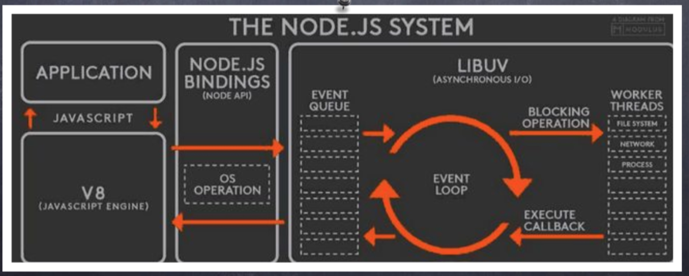
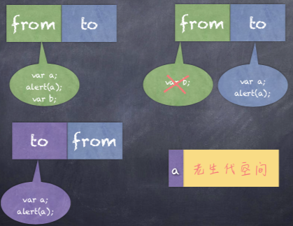
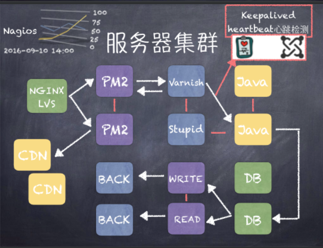

# 大规模 Node.js 项目架构与优化

为什么要选择 node 做一个中间层：

* node 可以消减 api 多余数据
* node 可以做 ssr
* node 更好的前后端分离与**独立上线**，如果没有中间层，前端直接连接 `java 或者 php`，耦合性高
* 不用 node ,一个前端刚入职就被要求装什么 `apache` `tomcat` ，装不上还被鄙视
* node 是基于异步的，吞吐量 大型聊天应用

怀疑 `node` 不稳定？容易崩？ 哪里就不稳定了？怎么就容易崩了？凭什么不能用呢？因为单线程（只要把容错做好，永远不会崩）？

`node` 不是说替代谁，而是 中间层 ，降低前后端耦合度

只做页面的叫**页面仔**，只写组件的叫**组件仔**，写组件+node的才叫真正的**前端**

京东的 `taro`

 ### NodeJS异步IO原理浅析及优化方案

#### 异步IO的是与非

* 前端通过异步IO可以消除UI堵塞
* 假设请求资源A的时间是M，请求资源B的时间为N，那么同步的请求耗时为：M+N，如果采用异步方式占用时间为Max(M,N)
* 随着业务的复杂，会引入分布式系统，时间会线性增加，M+N+…和Max（M,N,…），这会放大同步和异步之间的差异
* I/O是昂贵的，分布式I/O是更昂贵的
* NodeJs 适用于IO密集型不适用CPU密集型

| I/O类型 | 花费的CPU时钟⏲️周期 |
| ------ | ------ |
| CPU 一级缓存 | 3 |
| CPU 二级缓存 | 14 |
| 内存 | 250 |
| 硬盘 | 41000000 |
| 网络 | 240000000 |

一个CPU时钟周期： `1/cpu主频`：如：`1/2.7 GHz`
#### Node对异步IO的实现



异步IO是操作系统做的，NodeJs是单线程的，LIBUV是辅助 NodeJs进行 eventloop 的，LIBUV 封装了📦这么一套回调机制

CPU满了是因为并发🈵️了，内存🈵️了是因为变量，内存泄露等原因

#### 几个特殊的API

macrotask 和 microtask

使用`setImmediate`的时候万万要注意版本，不同版本是不同的，以下代码是在 `node`环境下面运行的，在浏览器下是没有 `setImmediate` 和 `process.nextTick`

> 同步>nextTick>micratask>macratask，这几个是不走 event-loop的

```javascript
setTimeout(function() {
  console.log(1);
}, 0);
setImmediate(function() {
  console.log(2);
});
process.nextTick(() => {
  console.log(3)
});
new Promise((resovle, reject) => {
  console.log(4);
  resovle(5);
}).then(function() {
  console.log(5);
});
console.log(6);
//4 6 3 5 1 2
```

用node去实现一个 sleep

```javascript
async function test() {
    console.log('Hello');
    await sleep(1000);
    console.log('world!');
}
function sleep(ms) {
	return new Promise(resolve => setTimeout(resolve, ms)); 
}
```

#### 常用的Node控制异步API的技术手段

* Step、wind（提供等待的异步库）、Bigpipe、Q.js
* Async\Await
* Promise/Defferred 是一种先执行异步调用，延迟传递的处理方式。Promise 是高级接口，事件是低级接口。低级接口可以构建更多复杂的场景，高级接口一旦定义，不太容易变化，不再有低级接口的灵活性，但对于解决问题非常有效
* 由于 Node 基于V8的原因，目前还不支持协程。协程不是进程和线程，其执行过程更类似于子例程，或者说不带返回值的函数调用。
* 一个程序可以包含多个协程，可以对比与一个进程包含多个线程，因而我们来比较下协程和线程。多个线程是相对独立的，有自己的上下文，切换受系统控制。而协程也相对独立，有自己的上下文，但是其切换由自己控制，由当前协程切换到其他协程由当前协程来控制

#### V8垃圾回收机制

在大多数程序中，绝大多数对象的生命周期很短，只有少部分对象拥有较长的生命周期，考虑到这一点，V8将堆分成了两代:**新生代（new-space）**及**老生代（old-space）**。分代式回收

在新生代中分配内存非常容易，持有一个指向内存区的分配指针，当需要给新对象分配内存时，递增指针即可。当分配指针**到达了新生代的末尾**，就会触发一个小垃圾回收周期（Scavenge算法），快速地从新生代中回收死去的对象。对于在两个小垃圾回收周期都存活下来的对象，则将其晋升（promote）至老生代

老生代在标记-清除（mark-sweep）或标记-整理（mark-compact）这样的非常不频繁的大垃圾回收周期中回收内存。**当足够数量的对象被晋升至老生代中后**，将触发一次大垃圾回收周期，至于具体时机，取决于老生代的内存大小及程序的行为

* Node 使用 JavaScript 在服务端操作大内存的对象时受到了一定的限制，64位系统下约为1.4G（老生代）32MB（新生代），32位系统下为 0.7G（老生代）16MB（新生代）。可以对这个默认值进行修改, 但这两个值也是有上限的，不能无限设置，其中老生代内存空间最大的值约为 1.7G，新生代最大内存空间约为 1.0G。如果 1.7G 的内存还是不够大怎么办呢？要知道 1.7G 是在 V8 引擎层面上做出的限制，要想避开这种限制，我们可以使用 `Buffer` 对象，`Buffer`对象的内存分配在 C++ 层面进行，不受 V8 引擎限制

* ```javascript
  node --max-old-space-size=1700 index.js
  node --max-new-space-size=1024 index.js
  ```

* node  中查看 V8 引擎的内存使用量方式： `process.memoryUsage();` 可以看这里 [Js 中的内存泄漏-基于Node.js环境](https://github.com/LiuHao713/task/blob/master/Js%20memory%20leak.md)，通过 `os.totalmem()` 方法和 `os.freemem()` 方法分别可以查看**操作系统的总内存**和**空闲内存**。

* V8 的垃圾回收策略主要是基于**分代式垃圾回收机制**，V8 中对内存分为**新生代**和**老生代**两代，新生代内存空间主要用来存放存活时间较短的对象，老生代内存空间主要用来存放存活时间较长的对象。对于垃圾回收，新生代和老生代有各自不同的策略
##### 新生代垃圾回收

新生代区域很小但是垃圾回特别频繁，新生代是一个典型的空间换时间的办法

> 新生代使用**Scavenge算法**进行回收。在Scavenge算法的实现中，主要采用了**Cheney算法**
>
> Cheney算法算法是一种采用复制的方式实现的垃圾回收算法。它将内存一分为二，每一部分空间称为semispace。在这两个 semispace中，一个处于使用状态，另一个处于闲置状态。处于使用状态的semispace空间称为From空间，处于闲置状态的空间称为To空 间，当我们分配对象时，先是在From空间中进行分配。当开始进行垃圾回收算法时，会检查From空间中的存活对象复制到To空间，非活跃对象占用的空间将会被释放，From空间和To空间的角色发生对换
>
> 使用Cheney算法时，总有一半的内存是空的。但是由于新生代很小，所以浪费 的内存空间并不大。
>
> 复制的过程采用的是BFS（广 度优先遍历）的思想，从根对象出发，广度优先遍历所有能到达的对象

新生代垃圾回收特点：内存区小、浪费一半空间、被清除的对象少，回收范围小、拷贝范围小、执行频率低且较慢




##### 对象的晋升

> 对象从From空间复制到To空间时，会检查它的内存地址来判断这个对象是否已经经历过一个新生代的清理，如果是，则复制到老生代中，否则复制到To空间中
>
> 对象从From空间复制到To空间时，如果To空间已经被使用了超过25%，那么这个对象直接被复制到老生代

##### 老生代垃圾回收
老生代所保存的对象大多数是**生存周期很长**的甚至是常驻内存的对象，而且老生代**占用的内存较多**

> 老生代占用内存较多（64位为1.4GB，32位为700MB），如果使用Scavenge算法，浪费一半空间不说，复制如此大块的内存消耗时间将 会相当长。所以Scavenge算法显然不适合。V8在老生代中的垃圾回收策略采用Mark-Sweep和Mark-Compact相结合

* Mark-Sweep（标记清除）

  > 标记清除分为标记和清除两个阶段。在标记阶段需要遍历堆中的所有对象，并标记那些活着的对象，然后进入清除阶段。在清除阶段，只清除没有被标记的对象。即垃圾对象。由于**垃圾对象占比很小，因此效率很高**
  >
  > 标记清除有一个问题就是进行一次标记清除后，内存空间往往是**不连续**的，会出现很多的内存碎片。如果后续需要分配一个需要内存空间较多的对象时，如果所有的内存碎片都不够用，将会使得V8无法完成这次分配，提前触发垃圾回收

* Mark-Compact（标记整理）

  > 标记整理正是为了解决标记清除所带来的**内存碎片**的问题。标记整理在标记清除的基础进行修改，将清除阶段变为紧缩极端。在整理的过程中，将活着的 对象向内存区的一段移动，移动完成后直接清理掉边界外的内存。紧缩过程涉及对象的移动，所以效率并不是太好，但是能保证不会生成内存碎片

标记清除和标记整理都分为两个阶段：**标记阶段**、**清除或紧缩阶段**

Chrome V8的老生代使用标记清除和标记整理结合的方式，主要采用标记清除算法，如果空间不足以分配从新生代晋升过来的对象时，才使用标记整理

老生代垃圾回收特点：内存区大、存放的对象生命周期很长、垃圾多、拷贝范围小、执行频率高且快

老生代是增量的回收

##### 常见内存泄露问题
* 无限制增长的数组
* 无限制设置属性和值
* 任何模块内的私有变量和方法均是永驻内存的
* 大循环

##### 内存泄露分析

```javascript
console.log('server pid', process.pid);
sudo node --inspect app.js
while true;do curl "http://localhost:1337"; done
top -pid 2223
```

##### PM2

> pm2 是一个带有负载均衡功能的Node应用的进程管理器
>
> 当我们想把我们的代码利用全部的服务器上的所有CPU，并保证进程永远都活着，0秒重载。pm2是一个不错的选择。

PM2 可以做到：

1.内建负载均衡（使用Node cluster 集群模块）2. 后台运行 3. 0秒停机重载 4.具有Ubuntu 和 CentOS的启动脚本 5.停在不稳定的进程（避免无限循环）6.控制台检测 7.提供 HTTP API 8.远程控制和实时的接口API（Nodejs模块运行和pm2进程管理器交互）

#### 服务器集群


现在也有很多用 `k8s + docker` 代替 `nginx + pm2`
