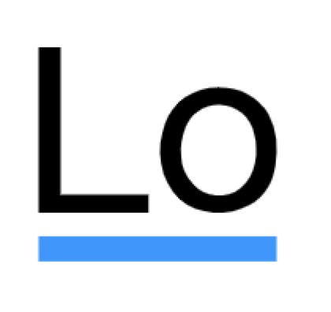

# Technology icon

### 关于函数式编程

* **Ramda**

* [Ramda英文官网](https://ramdajs.com/) [Ramda中文官网](http://ramda.cn/)
* 名字的由来
  * Ok, so we like sheep. That's all. It's a short name, not already taken. It could as easily have been `eweda`, but then we would be forced to say *eweda lamb!*, and no one wants that. For non-English speakers, lambs are baby sheep, ewes are female sheep, and rams are male sheep. So perhaps ramda is a grown-up lambda... but probably not.

* **lodash**
* [lodash英文官网](https://lodash.com/) [lodash中文官网](https://www.lodashjs.com/)
* 名字由来
  * 很明显是取的 `lodash` 前两个字母  

