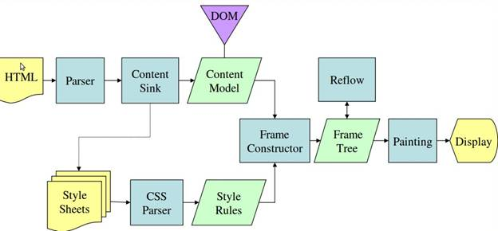
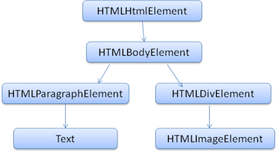

# 浏览器工作原理

在地址栏输入 `google.com` 直到您在浏览器屏幕上看到 Google 首页的整个过程中都发生了些什么?

目前使用的主流浏览器有五个：Internet Explorer、Firefox、Safari、Chrome 浏览器和 Opera。不同的浏览器内核，渲染过程不太一样

### 浏览器的主要功能

就是**向服务器发出请求**，在浏览器窗口中**展示您选择的网络资源**。资源一般是指 HTML 文档，也可以是 PDF、图片或其他的类型。资源的位置由用户使用 URI（统一资源标示符）指定

浏览器解释并显示 HTML 文件的方式是在 HTML 和 CSS 规范中指定的。这些规范由网络标准化组织 W3C（万维网联盟）进行维护。 

浏览器的用户界面并没有任何正式的规范，这是多年来的最佳实践自然发展以及彼此之间相互模仿的结果:

- 用来输入 URI 的地址栏
- 前进和后退按钮
- 书签设置选项
- 用于刷新和停止加载当前文档的刷新和停止按钮
- 用于返回主页的主页按钮

### 浏览器的主要组件

1. **用户界面** - 包括地址栏、前进/后退按钮、书签菜单等。除了浏览器主窗口显示的您请求的页面外，其他显示的各个部分都属于用户界面。
2. **浏览器引擎** - 在用户界面和呈现引擎之间传送指令。
3. **呈现引擎** - 呈现引擎的作用嘛...当然就是“呈现”了，也就是在浏览器的屏幕上显示请求的内容。如果请求的内容是 HTML，它就负责解析 HTML 和 CSS 内容，并将解析后的内容显示在屏幕上。Firefox 使用的是 **Gecko**，这是 Mozilla 公司“自制”的呈现引擎。而 Safari 和 Chrome 浏览器使用的都是 **WebKit**。
4. **网络** - 用于网络调用，比如 HTTP 请求。其接口与平台无关，并为所有平台提供底层实现。
5. **用户界面后端** - 用于绘制基本的窗口小部件，比如组合框和窗口。其公开了与平台无关的通用接口，而在底层使用操作系统的用户界面方法。
6. **JavaScript 解释器**。用于解析和执行 JavaScript 代码。
7. **数据存储**。这是持久层。浏览器需要在硬盘上保存各种数据，例如 Cookie。新的 HTML 规范 (HTML5) 定义了“网络数据库”，这是一个完整（但是轻便）的浏览器内数据库。


值得注意的是，和大多数浏览器不同，**Chrome 浏览器的每个标签页都分别对应一个呈现引擎实例**。每个标签页都是一个独立的进程。

webkit 内核渲染流程：


Mozilla 的 Gecko 呈现引擎主流程:



虽然主流浏览器渲染过程叫法有区别，但是主要流程还是相同的

Gecko 将视觉格式化元素组成的树称为“框架树”。每个元素都是一个框架。WebKit 使用的术语是“呈现树”，它由“呈现对象”组成。对于元素的放置，WebKit 使用的术语是**“布局”**，而 Gecko 称之为**“重排”**。

呈现引擎将开始解析 HTML 文档，并将各标记逐个转化成“DOM Tree”上的 [DOM](https://www.html5rocks.com/zh/tutorials/internals/howbrowserswork/#DOM) 节点。同时也会解析外部 CSS 文件以及样式元素中的样式数据。HTML 中这些带有视觉指令的样式信息将用于创建另一个树结构：[呈现树](https://www.html5rocks.com/zh/tutorials/internals/howbrowserswork/#Render_tree_construction)。

呈现树包含多个带有视觉属性（如颜色和尺寸）的矩形。这些矩形的排列顺序就是它们将在屏幕上显示的顺序。

呈现树构建完毕之后，进入“[布局](https://www.html5rocks.com/zh/tutorials/internals/howbrowserswork/#layout)”处理阶段，也就是为每个节点分配一个应出现在屏幕上的确切坐标。下一个阶段是[绘制](https://www.html5rocks.com/zh/tutorials/internals/howbrowserswork/#Painting) - 呈现引擎会遍历呈现树，由用户界面后端层将每个节点绘制出来。

需要着重指出的是，这是一个**渐进的过程**。为达到更好的用户体验，呈现引擎会力求尽快将内容显示在屏幕上。它不必等到整个 HTML 文档解析完毕之后，就会开始构建呈现树和设置布局。在不断接收和处理来自网络的其余内容的同时，呈现引擎会将部分内容解析并显示出来。

故基本流程如下：

* 1. HTML解析出**DOM Tree**
* 2. CSS解析出**Style Rules**
* 3. 将二者关联生成**Render Tree**
* 4. **Layout** 根据Render Tree计算每个节点的信息（重排）
* 5. **Painting** 根据计算好的信息绘制整个页面（重绘）

### HTML解析 DOM Tree

HTML Parser的任务是将HTML标记解析成DOM Tree, 可以参考React解析DOM的过程

DOM 与标记之间几乎是一一对应的关系。算法由两个阶段组成：**标记化**和**树构建**,(这里不讨论标记和构建算法的具体细节)比如下面这段标记：

```html
<html>
  <body>
    <p>
      Hello World
    </p>
    <div> </div>
  </body>
</html>
```

可翻译成如下的 DOM 树：



解析结束后：

在此阶段，浏览器会将文档标注为**交互状态**，并开始解析那些处于“deferred”模式的脚本，也就是那些应在文档解析完成后才执行的脚本。然后，文档状态将设置为“完成”，一个“加载”事件将随之触发

### CSS 解析

CSS Parser将CSS解析成Style Rules，Style Rules也叫CSSOM（CSS Object Model）

StyleRules也是一个树形结构，根据CSS文件整理出来的类似DOM Tree的树形结构

WebKit 内核 和 Firefox的 Gecko内核使用的解析算法也是不一样的：

WebKit 使用 [Flex 和 Bison](https://www.html5rocks.com/zh/tutorials/internals/howbrowserswork/#parser_generators) 解析器生成器，通过 CSS 语法文件自动创建解析器。正如我们之前在解析器简介中所说，Bison 会创建自下而上的移位归约解析器。Firefox 使用的是人工编写的自上而下的解析器。这两种解析器都会将 CSS 文件解析成 StyleSheet 对象，且每个对象都包含 CSS 规则。CSS 规则对象则包含选择器和声明对象，以及其他与 CSS 语法对应的对象


于HTML Parser相似，CSS Parser作用就是将很多个CSS文件中的样式合并解析出具有树形结构Style Rules

### 脚本处理

浏览器解析文档，当遇到`<script>`标签的时候，会立即解析脚本，停止解析文档（因为JS可能会改动DOM和CSS，所以继续解析会造成浪费）。
如果脚本是外部的，会等待脚本下载完毕，再继续解析文档。现在可以在script标签上增加属性 `defer`或者`async`。
脚本解析会将脚本中改变DOM和CSS的地方分别解析出来，追加到DOM Tree和Style Rules上。

### 呈现树（Render Tree）

Render Tree的构建其实就是DOM Tree和CSSOM Attach的过程。

呈现器是和 DOM 元素相对应的，但并非一一对应。非可视化的 DOM 元素不会插入呈现树中，例如“head”元素。如果元素的 display 属性值为“none”，那么也不会显示在呈现树中（但是 visibility 属性值为“hidden”的元素仍会显示）


####  样式表层叠顺序

某个样式属性的声明可能会出现在多个样式表中，也可能在同一个样式表中出现多次。这意味着应用规则的顺序极为重要。这称为“层叠”顺序。根据 CSS2 规范，层叠的顺序为（优先级从低到高）：

1. 浏览器声明
2. 用户普通声明
3. 作者普通声明
4. 作者重要声明
5. 用户重要声明

### 布局Layout(或者叫回流或重排)

创建完成并添加到呈现树时，并不包含位置和大小信息。计算这些值的过程称为布局或重排。

创建渲染树后，下一步就是布局（Layout）,或者叫回流（reflow,relayout），这个过程就是通过渲染树中渲染对象的信息，计算出每一个渲染对象的位置和尺寸，将其安置在浏览器窗口的正确位置，而有些时候我们会在文档布局完成后对DOM进行修改，这时候可能需要重新进行布局，也可称其为回流，本质上还是一个布局的过程，每一个渲染对象都有一个布局或者回流方法，实现其布局或回流

对渲染树的布局可以分为全局和局部的，全局即对整个渲染树进行重新布局，如当我们改变了窗口尺寸或方向或者是修改了根元素的尺寸或者字体大小等；而局部布局可以是对渲染树的某部分或某一个渲染对象进行重新布局。

大多数web应用对DOM的操作都是比较频繁，这意味着经常需要对DOM进行布局和回流，而如果仅仅是一些小改变，就触发整个渲染树的回流，这显然是不好的，为了避免这种情况，浏览器使用了脏位系统，只有一个渲染对象改变了或者某渲染对象及其子渲染对象脏位值为”dirty”时，说明需要回流。

#### Dirty 位系统

为避免对所有细小更改都进行整体布局，浏览器采用了一种“dirty 位”系统。如果某个呈现器发生了更改，或者将自身及其子代标注为“dirty”，则需要进行布局。

有两种标记：“dirty”和“children are dirty”。“children are dirty”表示尽管呈现器自身没有变化，但它至少有一个子代需要布局。

#### 全局布局和增量布局

全局布局是指触发了整个呈现树范围的布局，触发原因可能包括：

1. 影响所有呈现器的全局样式更改，例如字体大小更改。
2. 屏幕大小调整。

布局可以采用增量方式，也就是只对 dirty 呈现器进行布局（这样可能存在需要进行额外布局的弊端）。 
当呈现器为 dirty 时，会异步触发增量布局。例如，当来自网络的额外内容添加到 DOM 树之后，新的呈现器附加到了呈现树中。

增量布局是异步执行的 全局布局往往是同步触发的

#### 布局处理细节

布局通常具有以下模式：

1. 父呈现器确定自己的宽度。
2. 父呈现器依次处理子呈现器，并且：
   1. 放置子呈现器（设置 x,y 坐标）。
   2. 如果有必要，调用子呈现器的布局（如果子呈现器是 dirty 的，或者这是全局布局，或出于其他某些原因），这会计算子呈现器的高度。
3. 父呈现器根据子呈现器的累加高度以及边距和补白的高度来设置自身高度，此值也可供父呈现器的父呈现器使用。
4. 将其 dirty 位设置为 false。

### 绘制（Painting）

在绘制阶段，系统会遍历呈现树，并调用呈现器的“paint”方法，将呈现器的内容显示在屏幕上。绘制工作是使用用户界面基础组件完成的。

#### 全局绘制和增量绘制

和布局一样，绘制也分为全局（绘制整个呈现树）和增量两种。在增量绘制中，部分呈现器发生了更改，但是不会影响整个树。更改后的呈现器将其在屏幕上对应的矩形区域设为无效，这导致 OS 将其视为一块“dirty 区域”，并生成“paint”事件。

#### 绘制顺序

1. 背景颜色
2. 背景图片
3. 边框
4. 子代
5. 轮廓

这里还要说两个概念，一个是**Reflow**，另一个是**Repaint**。这两个不是一回事。

**Repaint**（重绘） ——屏幕的一部分要重画，比如某个CSS的背景色变了。但是元素的几何尺寸没有变。

**Reflow**（回流） 元件的几何尺寸变了，我们需要重新验证并计算Render Tree。是Render Tree的一部分或全部发生了变化。这就是Reflow，或是Layout。

Reflow的成本比Repaint的成本高得多的多。DOM Tree里的每个结点都会有reflow方法，一个结点的reflow很有可能导致子结点，甚至父点以及同级结点的reflow。在一些高性能的电脑上也许还没什么，但是如果reflow发生在手机上，那么这个过程是非常痛苦和耗电的。 所以，下面这些动作有很大可能会是成本比较高的。

基本上来说，reflow（重排）有如下的几个原因：

- Initial。网页初始化的时候。
- Incremental。一些Javascript在操作DOM Tree时。
- Resize。其些元件的尺寸变了。
- StyleChange。如果CSS的属性发生变化了。比如盒子模型，边距、边框这些改变
- Dirty。几个Incremental的reflow发生在同一个frame的子树上。

一些出发回流和重绘的操作

```javascript
$('body').css('color', 'red'); // repaint
$('body').css('margin', '2px'); // reflow, repaint

var bstyle = document.body.style; // cache

bstyle.padding = "20px"; // reflow, repaint
bstyle.border = "10px solid red"; //  再一次的 reflow 和 repaint

bstyle.color = "blue"; // repaint
bstyle.backgroundColor = "#fad"; // repaint

bstyle.fontSize = "2em"; // reflow, repaint

// new DOM element - reflow, repaint
document.body.appendChild(document.createTextNode('dude!'));
```

当然，我们的浏览器是聪明的，它不会像上面那样，你每改一次样式，它就reflow或repaint一次。一般来说，浏览器会把这样的操作积攒一批，然后做一次reflow，这又叫异步reflow或增量异步reflow。但是有些情况浏览器是不会这么做的，比如：resize窗口，改变了页面默认的字体，等。对于这些操作，浏览器会马上进行reflow。

但是有些时候，我们的脚本会阻止浏览器这么干，比如：如果我们请求下面的一些DOM值：

```javascript
offsetTop, offsetLeft, offsetWidth, offsetHeight
scrollTop/Left/Width/Height
clientTop/Left/Width/Height
IE中的 getComputedStyle(), 或 currentStyle
```

### Chrome调试工具查看页面渲染顺序

可以通过 chrome 浏览器的 performance 录制页面，查看 call tree 和 event log

也可以查看performance monitor 实时监控内存使用量，这个工具可以很好的测试 内存泄漏

以前 chrome 还有timeline的时候更加直观：

可以很清楚的看见页面的过程：

1. 发起请求；
2. 解析HTML；
3. 解析样式；
4. 执行JavaScript；
5. 布局；
6. 绘制


### 页面渲染优化

浏览器对上文介绍的关键渲染路径进行了很多优化，针对每一次变化产生尽量少的操作，还有优化判断重新绘制或布局的方式等等。
在改变文档根元素的字体颜色等视觉性信息时，会触发整个文档的重绘，而改变某元素的字体颜色则只触发特定元素的重绘；改变元素的位置信息会同时触发此元素（可能还包括其兄弟元素或子级元素）的布局和重绘。某些重大改变，如更改文档根元素的字体尺寸，则会触发整个文档的重新布局和重绘，据此及上文所述，推荐以下优化和实践：

1. HTML文档结构层次尽量少，最好不深于六层；
2. 脚本尽量后放，放在前即可；
3. 少量首屏样式内联放在标签内；
4. 样式结构层次尽量简单；
5. 在脚本中尽量减少DOM操作，尽量缓存访问DOM的样式信息，避免过度触发回流；
6. 减少通过JavaScript代码修改元素样式，尽量使用修改class名方式操作样式或动画；
7. 动画尽量使用在绝对定位或固定定位的元素上；
8. 隐藏在屏幕外，或在页面滚动时，尽量停止动画；
9. 尽量缓存DOM查找，查找器尽量简洁；
10. 涉及多域名的网站，可以开启域名预解析