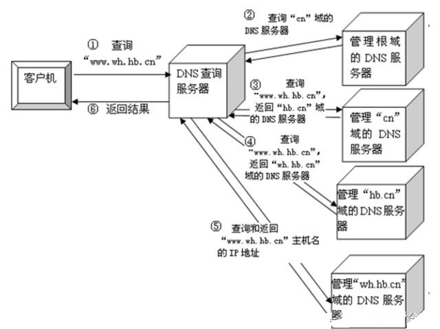

# DNS 解析流程

### DNS详解

* DNS 是  Domain Name System, 域名系统，用于将域名转换为IP，域名和IP地址相互映射的一个分布式数据库，通过主机名，最终得到该主机名对应的IP地址的过程叫做域名解析，**DNS可以使用TCP和UDP的53端口，基本使用UDP协议的53端口**，DNS 的分布式数据库是以域名为索引的，每个域名实际上就是一棵很大的逆向树中路径，这棵逆向树称为域名空间

### 域的分类
#### 根域

- 根域	：	**.**
- 无论是 `baidu.com` 还是 `www.baidu.com`其实是 `www.baidu.com.`

#### **顶级域**

- 按国家划分：.cn(中国)、.tw(台湾)、.hk(香港) 等
- 按组织性质划分：.org、.net、.com、.edu、.gov 等
- 反向域：arpa ，这是反向解析的特殊顶级域

#### 普通域

* 顶级域下来就是普通的域，公司或个人在互联网上注册的域名一般都是这些普通的域
* 如： `baidu.com` `jd.com` `qunar.com`

### 域名解析流程

* 以` www.wh.hb.cn` 为例子

* 首先浏览器先检查本地 `hosts`文件是否有这个映射关系，如果有就使用这个IP地址映射，完成域名解析，比如在 hosts 里面设置了 `127.0.0.1 www.baidu.com`,当我们访问 `www.baidu.com`时就会访问 `127.0.0.1`

* 如果没有映射，就会到达 **本地DNS服务器**（用户自己电脑网络设置里的DNS），本地DNS服务器会首先查询它的**缓存记录**，如果缓存中有此条记录，就可以直接返回结果。如果没有则继续往下走
* 本地DNS服务器会从**配置文件**里面读取**13个根域名服务器**的地址（这些地址是不变的，直接在BIND的配置文件中）
* 向其中一台**根域名服务器**发起请求, 根域名服务器发现要查询的是 `cn.`域，于是返回管理 `cn.`域名的域名服务器给dns服务器，dns服务器则向该地址又发起请求，该 `cn.`域名的域名服务器发现要查询的是`hb.cn.`域，于是又返回给dns服务器管理 `hb.cn.`域的域名服务器，dns服务器则向该地址又发起请求，该  `hb.cn.`域名的域名服务器发现要查询的是`wh.hb.cn.`域，… … 以此类推最总请求到管理 `wh.hb.cn.`域的dns服务器，匹配到了`www.wh.hb.cn` 这个域名对于的IP地址返回给 dns 服务器 ，再返回给客户的浏览器，浏览器再向该ip地址对应的机器发起请求

* a 记录：将对应的主机名映射到对应地址的ip地址上
* cname：别名，即当前查询域名是另一个域名的调整，增加灵活性, 比如有多个域名解析到同一个 ip的时候，后面的域名就可以指向前面的域名，选择cname解析
* mx：邮件解析，用于返回接收电子邮件的地址