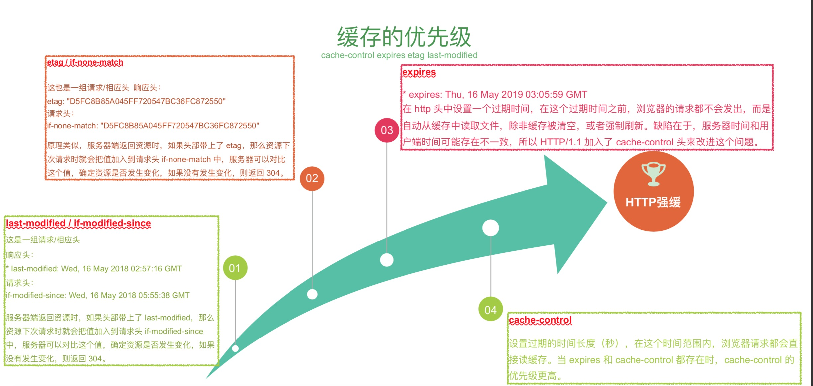
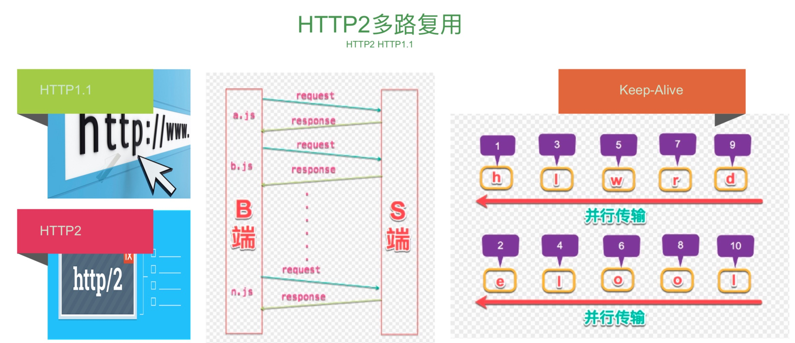
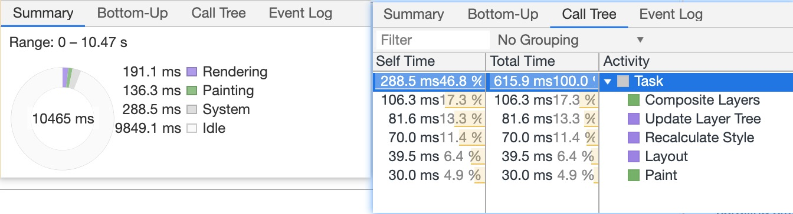
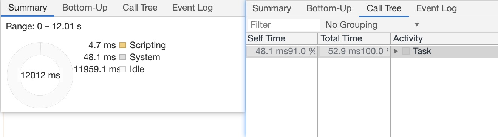

# 前端性能优化

为什么要做性能优化？？？

这里有一些数据：

* 57%的⽤用户更更在乎⽹网⻚页在3秒内是否完成加载。
* 52%的在线⽤用户认为⽹网⻚页打开速度影响到他们对⽹网站的忠实度。
* 每慢1秒造成⻚页⾯面 PV 降低11%，⽤用户满意度也随之降低降低16%。
* 近半数移动⽤用户因为在10秒内仍未打开⻚页⾯面从⽽而放弃

性能优化就是在挽救我们的用户，就是在创收，恰恰是平时业务中容易忽略的一点

### 下面👇是一些基本的优化点：

* 铁律：合并http请求（5个）合并文件（不能大于28k）

* 多开 cdn 比如`i.meituan.com` 美团就开了 3 个cdn 比如 6 * 5 = 30

  * ```html
    <link href="//p1.meituan.net" rel="dns-prefetch">
    <link href="//p0.meituan.net" rel="dns-prefetch">
    <link href="//ms0.meituan.net" rel="dns-prefetch">
    ```

* 服务器开启 `gzip`， `http1.1 keep-alive` `http2` http2一旦开启 多开 cdn也就没有必要了，但是为了保证向下降级现在还是基本可以用 cdn 我们不能期望服务器都支持 http2
* 把  `js`写入一张图片
* 离线缓存 `localStorage` 可以把 `js` 放在本地里面，里面是字符串，拿出来后 `addScript` 或者 `evil`，这是一个很直接的方法减少请求数量，但是`localStorage` 空间也是比较小的，5M，不能随便的乱用，当然可以本地进行扩容
* 前端 ORM 存储方案 `localForage`

* 雅虎军规
* 缓存策略优先级非常重要 **cache-control > expires > Etag > Last Modify**，清楚过后才知道什么时候去设置 **强缓**，有针对性的和运维沟通优化策略，**业务的东西走离线缓存，库走http强缓（jquery vue react.min 字体库 这些东西）**，业务的东西我们可以用激活的js 去负责所有业务



* 根据用户网络类型（检测用户网络）（2g 3g等）提供不同的资源如（2g提供小的资源，网络好则提供高清资源），检测用户网络类型可以用 h5 天生的属性： connection.type 但是呢，这个东西浏览器的支持程度是不怎么好的，我们可以用图片去测试速度 ：速度 = 时间 / 文件大小
  * 这里介绍一种 多普勒 测试，分五次请求计算公式
  * 一旦我们通过各种方法得到了用户的带宽 网速，我们就可以根据网速干我们想干的事，比如网络不好就给一倍图，网络好就给2倍图，等等

上面说到了 http2 : 

浏览器器请求//xx.cn/a.js-->解析域名—>HTTP连接—>服务器器处理理⽂文件—>返回数据-->浏览器器解析、渲染⽂文件。Keep-Alive解决的核⼼心问题就在此，一定时间内，同一域名多次请求数据，只建⽴一次HTTP请求，其他请求可复用每一次建立的连接通道，以达到提高请求效率的问题。一定时间是可以配置的，HTTP1.1还是存在效率问题，第一个:串行的⽂件传输。第二个:连接数过多。HTTP/2对同一域名下所有请求都是基于流，也就是说同⼀一域名不管访问多少文件，也只建⽴一路连接。同样Apache的最大连接数为300，因为有了这个新特性，最大的并发就可以提升到300，⽐比原来提升了了6倍!



### 渲染🀄️性能优化

浏览器 f12 里面有一个 `performance`事性能的东西，在这里可以录制页面，可以看见性能的比如重排、重绘的时间

**重排（Rendering）**：摆积木就是重排，**重绘(Painting)**：往积木上面贴纸就是重绘，所以重排一点会引起重绘，但是重绘不一定引起重排

网页加载dom到绘制结束流程：

`gpu.js`可以专门做性能优化，让 js 代码跑在 gpu 里面，比跑在 cpu 里面更快

* 例子一：下面👇的代码跑起来会不断的引起浏览器的重排和重绘，若网页中这种操作过于多则性能会降低，导致页面卡顿
  * 我们利用chrome调试🔧录制10s的页面，可以看到我们的动画矩形在浏览器窗口里面运动，而且是**绿色的**，页面刚刷新的时候 `body` 是绿色的，后面就是这个矩形一直是绿色的，这说明了一个问题：页面刚开始刷新时 body 进行了一次重排和重绘，之后就是矩形一直在重排和重绘


从上图我们可以看出浏览器一直在进行：

**合成Layers->更新Layers->计算Style->回流Layout->重绘Paint**

```html
<!DOCTYPE html>
<html lang="en">

<head>
    <meta charset="UTF-8">
    <meta name="viewport" content="width=<device-width>, initial-scale=1.0">
    <meta http-equiv="X-UA-Compatible" content="ie=edge">
    <title>渲染中优化</title>
    <style>
        .container{
            position: relative;
        }
        .ball{
            width: 100px;
            height: 100px;
            border: 2px solid #f60;
            position: absolute;
            top:0;
            left: 0;
        }
        .ball-running {
            animation: run-aroud 4s infinite;
        }

        @keyframes run-aroud 
        {
            0% {
                top: 0;
                left: 0;
            }
            25% {
                top: 0;
                left: 200px;
            }
            50% {
                top: 200px;
                left: 200px;
            }
            75% {
                top:200px;
                left: 0;
            }
        }
    </style>
</head>

<body>
    <div class="container">
        <div id="ball" class="ball">

        </div>
    </div>

    <script>
        let ball = document.getElementById('ball')
        ball.classList.add('ball-running');
    </script>
</body>

</html>
```

现在我们将代码做改动：

```html
<!DOCTYPE html>
<html lang="en">

<head>
    <meta charset="UTF-8">
    <meta name="viewport" content="width=<device-width>, initial-scale=1.0">
    <meta http-equiv="X-UA-Compatible" content="ie=edge">
    <title>渲染中优化</title>
    <style>
        .container{
            position: relative;
        }
        .ball{
            width: 100px;
            height: 100px;
            border: 2px solid #f60;
            position: absolute;
            top:0;
            left: 0;
        }
        .ball-running {
            animation: run-aroud 4s infinite;
        }

        @keyframes run-aroud 
        {
            0% {
                /* top: 0;
                left: 0; */
                transform: translate(0, 0);
            }
            25% {
                /* top: 0;
                left: 200px; */
                transform: translate(0, 200px);
            }
            50% {
                /* top: 200px;
                left: 200px; */
                transform: translate(200px, 200px);
            }
            75% {
                /* top:200px;
                left: 0; */
                transform: translate(200px, 0);
            }
        }
    </style>
</head>

<body>
    <div class="container">
        <div id="ball" class="ball">

        </div>
    </div>

    <script>
        let ball = document.getElementById('ball')
        ball.classList.add('ball-running');
    </script>
</body>

</html>
```

同样的，我们利用chrome调试🔧录制10s的页面，结果如下：

可以看出，我们修改后的代码已经**没有页面重排和重绘**的步骤了，这是因为采用了 gpu 的原因

