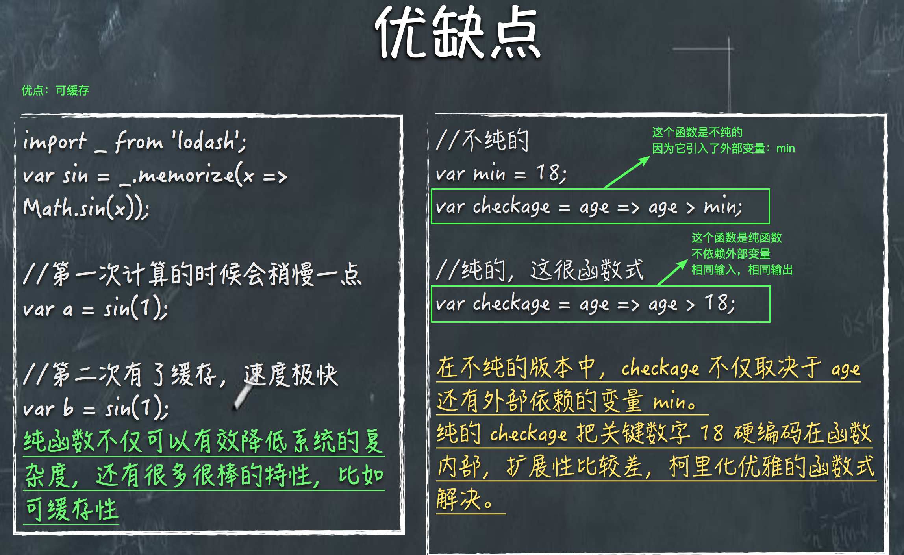
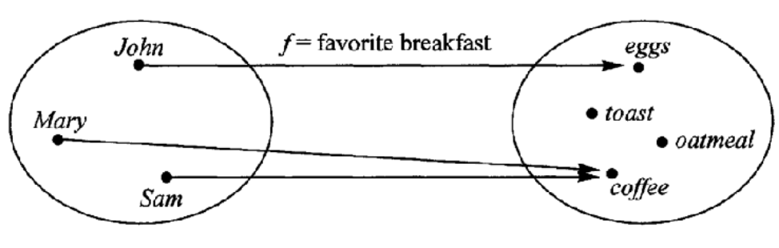

# 函数式编程

* functional programming

* 函数是一等公民，所谓一等公民指的是与其他数据类型一样，处于同等地位，可以赋值给其他变量、也可以作为参数传给另一个函数、或者作为别的函数的返回值
* 在函数式编程中，变量是不能被修改的，所有的变量只能被赋值一次
* 总结函数式编程的特点：
  * 函数是`一等公民`（就是所有变量里面的贵族，优先考虑函数）
  * 只用`表达式` ，不用`语句`，在函数式编程里面没有 `if else switch try catch ` 等，是用数学的思维去解决问题
  * 没有副作用、不修改状态、引用透明（函数运行只考参数）

#### 纯函数

* 对于相同的输入，永远得到相同的输出

* 没有任何可观察的副作用，不依赖外部环境状态

* ```javascript
  var a = [12, 5, 8, 1, 2, 3];
  //Array.slice 是纯函数，因为它没有副作用，并且对于相同的输入总能得到相同的输出
  a.slice(0, 3);
  a.slice(0, 3);
  a.slice(0, 3);
  a.slice(0, 3);
  //Array.splice 就不是纯函数，它修改了原来的数组，并且每次相同的输入会得到不同的输出
  ```

* `map` 和 `reduce` 就是标准的 纯函数



#### 幂等性

* 幂等性是指 函数执行无数次后还具有相同的效果，对于同一个参数，函数运行一次和运行两次结果一致

```javascript
Math.abs(-12);// 这就符合 幂等性
```

#### 柯里化

* 柯里化 是将**接受多个参数的函数变成 只接受一个参数的函数**，其实是将参数存起来，原理就是**闭包**

* ```javascript
  // 比如上图中的 函数 checkage 
  var checkage18 = min => (age => age > min);
  ```

* 

#### 函数组合

* 有时候我们很容易写出洋葱式代码：`h(g(f(x)))`，这是可以考虑函数组合

* ```javascript
  const conpose = (g, f) => (x => g(f(x)));
  var first = arr => arr[0];
  var reverse = arr => arr.reverse();
  var last = conpose(reverse, first);
  last([1, 2, 3, 4, 5]);
  ```

#### point free风格 

* 帮助我们减少不必要的命名，保持代码的简介和通用

* ```javascript
  const compose = (f, g) => (x => f(g(x))); // 先运行 g函数，得到的结果再传给 f
  var uoUpperCase = word => word.toUpperCase();
  var split = x => (str => str.split(x));
  var f = compose(split(" "), uoUpperCase);
  var result = f("abcd efgh"); // 先将字符串转为大写，再安装空格分割
  console.log(result); // [ 'ABCD', 'EFGH' ]
  ```

#### 声明式代码和命令式代码

* 命令式代码：我们通过编写一条又一条的指令去让计算机执行一些动作，这其中一般都会涉及到很多繁杂的细节，而声明式就要优雅很多，我们通过写表达式的方式来声明我们想干什么，而不是通过一步一步的指示

```javascript
// 命令式
let RDs = [];//存放 开发人员的数组
for (var i = 0; i< companies.length; i++) {
    RDs.push(companies[i].rd);
}
// 声明式
let RDs = companies.map(c => c.rds);
```

#### 高阶函数

* 函数当参数，把传入的函数做一个封装，然返回这个封装函数，达到更高程度的抽象

* ```javascript
  var add = function(a, b) {
      return a + b;
  }
  function math(func, array) {
      return func(array(0), array(1));
  }
  math(add, [1,2]);
  ```

* 高阶函数的总结：

    1. 它是一等公民（因为是函数）
    2. 它以一个函数作为参数
    3. 以一个函数作为返回结果

* 堆栈溢出和死循环的区别（爆栈浏览器会报错，而死循环式根本没有办法执行其他的东西）

#### 尾递归调用
* 未完待续
#### 再说闭包
* 别担忧去使用闭包，闭包式有内存泄漏，适当的使用是没有问题的，可以 ` = null` 去手动释放
* 闭包就是 拿到了你本不应该拿到的东西
* 下周周六前交作业，下周4给我们试卷，周五讲试卷，周天讲作业
#### 范畴与容器

* 我们可以把`范畴`想象成一个容器，里面包含两样东西，值（value）、值的变形关系，也就是函数
* 函数不仅可以用于同一个范畴之中值的转换，还可以用于将一个范畴转换成另一个范畴，这就涉及到了 `函子（Functor）`
* `函子`是函数式编程里面最重要的数据类型，也是基本的运算单位和功能单位。它首先是一种范畴，也就是说，是一个容器，包含了值和变形关系。比较特殊的是，它的变形关系可以依次作用于每一个值，将当前容器变形成另一个容器。



#### 函子

* 首先 **函子** 是一个容器

* 任何具有 `map` 方法的数据结构，都可以当作函子的实现

* 下面的 `Container` 叫容器，有了 `map` 过后叫 函子

* ```javascript
  // 这是一个容器
  var Container = function(x) {
      this.__value = x;
  }
  // 函数式编程一般约定，函子又一个 of 方法，为了区别于 oop
  Container.of = x => new Container(x);
  // 一般还约定，函子的标志就是容器具有 map 方法，该方法将容器里面的每一个值，映射到另一个容器里面
  // map 方法接受一个 变形关系 f
  Container.protorype.map = function(f) {
      return Container.of(f(this.__value));
  }
  Container.of(3)
  .map(x => x + 1)	// 通过变形关系得到一个新的函子 Container(4)
  .map(x => 'Result is' + x); // 得到另一个函子 Container('Result is 4')
  ```

* ```javascript
  // 写成 es6 如下
  class Functor{
      constructor(val){
          this.val = val;
      }
      nap(f){
          return new Functor(f(this.val));
      }
  }
  ```

* 上面的 `Functor` 就是一个 函子，它的 `map` 方法接受一个 变形方法，返回一个新的函子

* 再次重申一下：一般约定，函子的标志就是容器具有 `map` 方法。该方法将容器里面的每一个值，映射到另一个容器

* 函数式编程里面的运算，都是通过函子完成的，学习函数式编程，实际上就是学习函子的各种运算，就是运用不同的函子，解决实际问题

##### maybe 函子

* 用 三元去做 或者 `||`

* 函子接受各种函数，处理容器内部的值。这里就有一个问题，容器内部的值可能是一个空值（比如`null`），而外部函数未必有处理空值的机制，如果传入空值，很可能就会出错。

* ```javascript
  Functor.of(null).map(function (s) {
    return s.toUpperCase();
  });
  // TypeError
  ```

* 

##### Either函子

##### ap函子

##### IO函子

#### 函数式编程相关库

* RxJS
* underscorejs
* lodash
* ramdajs

### task

* YII 开发图书管理系统（PHP + MYSQL 使用php后端模板，增、删、改、查） 
* （期限：2018.11.16晚）
* MVC
* PHP ES9
* 数据库 性能优化 JS

* 了解后端 为 Nodejs 做好准备
* 学习新框架 YII
* Vue SSR

周四发试卷

周五讲试卷

周六作业讲解

周一至周五 看深度提升的录播课


=======================


第一周实战作业：


Yii开发一个图书管理系统（能删 能加 能查）严谨JS PHP模板

⌚️开发这个项目的⌚️

1.为啥要样YII 学习经典的MVC 

2.PHP的语言和ES9非常像

3.为什么要学数据库 性能优化 JS 

4.PHP为了解真正后端 为NodeJS做准备

5.学习不认识的YII 能够取学习新框架能力

6.为什么PHP模板为了学习Vue SSR

7.html不能使用自定义的HTML


