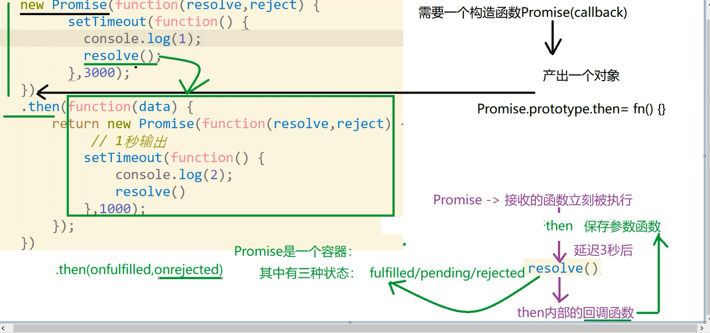

Promise

### Promise是什么？

- 直接打印出来看看 console.dir(Promise); 可以看出 Promise 其实是一个构造函数，自身有all,race,reject,resolve等方法，其原型上有catch,then,finally等方法
- Promise的构造函数接收一个参数，是函数，并且传入两个参数：resolve，reject，分别表示异步操作执行成功后的回调函数和异步操作执行失败后的回调函数。其实这里用“成功”和“失败”来描述并不准确，按照标准来讲，resolve是将Promise的状态置为fullfiled，reject是将Promise的状态置为rejected。
### Promise.all() 方法并行执行多个异步操作
Promise.all() 表示其中的Promise异步操作都执行完毕了才会去掉用.then方法
Promise.all([p1,p2]).then((data)=>{},(errdata)=>{}).catch()里面的多个异步p1，p2是并行执行的，所耗时间将是多个异步操作中耗时最长的耗时。不是按照实例化Promise对象的先后顺序实现的，但是返回的结果却是按照顺序返回的

```javascript
const fs = require('fs');
function createPromise(url){
return new Promise((resolve,reject)=>{
    fs.readFile(url,(err,data)=>{
    if (err) {
        reject(`error mes:${err}`);
    } else {
        resolve(JSON.parse(data));  
    }
    });
});
}
Promise.all(
[createPromise('./files/test01.json'),
createPromise('./files/test002.json')]
).then((data)=>{
console.log(data);
},(err)=>{
console.log(err);
});

console.log('后续代码');//这行代码会先执行，最先输出
```
```javascript
//以下代码：虽然是先实例化的写操作，后实例化的读操作，但是会先执行读操作
var a = new Promise(function  (resolve,reject) {
    setTimeout(function  () {
        fs.writeFile('./files/test002.txt','66666',(err)=>{
            if (err) {
                reject('写入失败');
            } else {
                resolve('写入成功');
            }
        });
    },10000);
});

var b = new Promise(function  (resolve,reject) {
    setTimeout(function  () {
        fs.readFile('./files/test002.txt',(err,data)=>{
            if (err) {
                reject(err);
            } else {
                resolve(data);
            }
        });
    },1000);
});

var p = Promise.all([a,b]);
p.then(function(val) {
    console.log(val);
});
```
### Promise.race() 方法
和promise.all() 对应的是promise.race()，promise.race([p1,p2]).then(()=>{},()=>{}); 表示竞速（也就是多个异步操作只要有一个完成了就去执行.then方法）
```javascript
var a = new Promise(function  (resolve,reject) {
    setTimeout(function  () {
        fs.writeFile('./files/test002.txt','aaaaa',(err)=>{
            if (err) {
                reject('写入失败');
            } else {
                resolve('写入成功');
            }
        });
    },10000);
});

var b = new Promise(function  (resolve,reject) {
    setTimeout(function  () {
        fs.readFile('./files/test002.txt',(err,data)=>{
            if (err) {
                reject(err);
            } else {
                resolve(data);
            }
        });
    },1000);
});

Promise.race([a,b]).then(function(val) {
    console.log(val);
});
//以上代码会在  读操作执行完毕后立即去执行 .then()方法，并输出数据，但是10s后 文件test002.txt的数据又会改变
```
### Promise按顺序执行多个异步
```javascript
//使用then做链式操作,按顺序依次执行多个异步操作
const FS = require('fs');
let readFilePromise = (url)=>{
    return new Promise((resolve,reject)=>{
        setTimeout(()=>{FS.readFile(url,(err,data)=>{if(err){reject(err)}else{resolve(JSON.parse(data))}})},1000);
    });
};
let readFilePromise1 = (url)=>{
    return new Promise((resolve,reject)=>{
        setTimeout(()=>{FS.readFile(url,(err,data)=>{if(err){reject(err)}else{resolve(JSON.parse(data))}})},10000);
    });
};


readFilePromise('./files/test01.json').then(data => {
    console.log(data);  // 打印第 1 个文件内容
    return readFilePromise1('./files/test002.json');
}).then(data => {
    console.log(data)  // 打印第 2 个文件内容
    return readFilePromise('./files/test03.json');
}).then(data => {
    console.log(data);  // 打印第 3 个文件内容
    return readFilePromise('./files/test04.json');
}).then(data=> {
    console.log(data);  // 打印第 4 个文件内容
});
```

### Generator 函数和普通的函数区别

1. function 和函数名之间有一个 `*` 号。 `*` 可以贴着函数名写，也可以贴着 function 后面写，但就是不能都贴着写 `function*show()`

2. 函数体内部使用了 `yield` 表达式

3. Generator函数的调用方法与普通函数一样，也是在函数名后面加上一对圆括号。不同的是，调用Generator函数后，该函数并不执行，返回的也不是函数运行结果，而是一个指向内部状态的指针对象，我们可以通过调用 next 方法，使得指针移向下一个状态

   ```javascript
   function * show (num1,num2) {
       alert(`${num1}:${num2}`);
       let a = yield 33;//33 表示第一个环节next的返回的中间结果
       alert("b");
       alert(a);
       return 44;//对应最后一个next的返回值
   }
   let geneObj = show(11,22);//generator函数不会直接执行里面的代码，而是返回一个对象
   let aa = geneObj.next(1);//踹一脚，走一步  第一个next是没法给yield传参的 弹出 11:22
   let bb = geneObj.next(2);//踹一脚，走一步 弹出 b 2
   console.log(aa);//{value: 33, done: false}
   console.log(bb);//{value: 44, done: true}
   ```

- generator 生成器 yield 放弃执行的权利
- 普通函数： 是一条道走到黑，不会停的
- generator 函数可以停(走走停停)
- generator 函数不能写成箭头函数的形式
- yield 可以往里面传东西(通过next传)，可以返回一个中间结果对象
- 如果碰到了 yield ， 就会把 yield 后面的值作为一个中间结果对象返回， 此时函数相当于停止了， 下次再执行 next() 方法的时候， 函数又会从上次退出去的地方重新开始执行
- 如果把 yield 和 return 一起使用的话， 那么 return 的值也会作为最后的返回值， 如果 return 语句后面还有 yield ， 那么这些 yield 不生效
- 不能在非 Generato r函数中使用 yield

```javascript
function* f() {
    for(let i = 0; true; i++) {
        var reset = yield i;
        console.log(`reset${i}`, reset);
    }
}
var g = f();
console.log(g.next(11)); // { value: 0, done: false }
console.log(g.next(22)); // { value: 0, done: false }
console.log(g.next(33)); // { value: 0, done: false }

{ value: 0, done: false }
reset0 22
{ value: 1, done: false }
reset1 33
{ value: 2, done: false }
```

### async 配合 await

据说是异步编程终级解决方案的 async/await 是非常甜的语法糖(是generator的高级封装) JavaScript 的 async/await 实现离不开 Promise

```javascript
let sleep = (time)=>{
return new Promise((resolve,reject)=>{
    setTimeout(()=>{resolve('ok');},time);
});
};
(async function fn(){
try{
    console.log(new Date());
    let time = await sleep(10000);
    console.log(time);
    console.log(new Date());
} catch (err) {
    console.log(err);
}
})();
console.log("1234");//由于async是异步的  故这行代码不会被阻塞
//上面的代码输出如下：
2018-04-07T07:29:51.741Z
1234
ok
2018-04-07T07:30:01.747Z
//可以看到，1234 提前输出了，代表代码没有被阻塞，而是异步执行的
```

```javascript
const FS = require('fs');
//该函数返回一个Promise对象
let getFiles = (url,time)=>{
    return new Promise((resolve,reject)=>{
        setTimeout(()=>{
            FS.readFile(url,(err,data)=>{if (err){reject(err);}else{resolve(JSON.parse(data))}});
        },time);
    });
};
//立即执行一个async函数，里面await等待一个Promise resolve
//里面的每一个await是按照顺序执行的
(async function(){
console.log('start开始时间：'+ new Date());
let file1 = await getFiles('./files/test01.json',5000);
console.log('第一个文件读取操作结束时间：'+ new Date());
let file2 = await getFiles('./files/test002.json',4000);
console.log('第二个文件读取操作结束时间：'+ new Date());
let file3 = await getFiles('./files/test03.json',3000);
console.log('第三个文件读取操作结束时间：'+ new Date());
let file4 = await getFiles('./files/test04.json',2000);
console.log('第四个文件读取操作结束时间：'+ new Date());
return [file1,file2,file3,file4];
})().then((data)=>{
    console.log('异步操作全部成功时间：'+ new Date());
    console.log(data)}
);
console.log('1');//由于是异步的，故该行代码不会被阻塞
//以上代码的输出如下：
start开始时间：Sat Apr 07 2018 15:43:10 GMT+0800 (中国标准时间)
1
第一个文件读取操作结束时间：Sat Apr 07 2018 15:43:15 GMT+0800 (中国标准时间)
第二个文件读取操作结束时间：Sat Apr 07 2018 15:43:19 GMT+0800 (中国标准时间)
第三个文件读取操作结束时间：Sat Apr 07 2018 15:43:22 GMT+0800 (中国标准时间)
第四个文件读取操作结束时间：Sat Apr 07 2018 15:43:24 GMT+0800 (中国标准时间)
异步操作全部成功时间：Sat Apr 07 2018 15:43:24 GMT+0800 (中国标准时间)
[ { name: 'zhangsan', age: 24, height: 172 },
{ name: 'lisi', age: 34 },
{ name: 'xiaoming', age: 3098 },
{ name: 'liuhaooo', age: 27 } ]
```

- 看上面的结果：1是提前输出了的，说明是异步执行的，并且async里面的各个异步操作是按照顺序执行的
- 注意几点：
  - 正常情况下，await 命令后面跟着的是 Promise ，如果不是的话，也会被转换成一个 立即 resolve 的 Promise
  - await 命令后面的 Promise 对象，运行结果可能是 rejected，所以最好把 await 命令放在 try…catch 代码块中
  - async 函数内部 return 返回的值。会成为 then 方法回调函数的参数
  - await 命令只能用在 async 函数之中，如果用在普通函数，就会报错

### Promise 源码实现
* `new Promise( function (resolve, reject) {})` 的时候传入的参数（一个函数会立即被执行）
* new 出来的 Promise 对象立马可以调用 .then 方法，这说明了 Promise 实例 的原型上具有 .then 方法
* .then 可以链式调用说明了 .then 方法返回了一个 Promise 对象
* .then 方法的主要作用就是将成功和失败的回调函数保存起来，以待后续的调用
* 

源码实现（全面）：

```javascript
  // 判断变量否为function
  const isFunction = variable => typeof variable === 'function'
  // 定义Promise的三种状态常量
  const PENDING = 'PENDING'
  const FULFILLED = 'FULFILLED'
  const REJECTED = 'REJECTED'

  class MyPromise {
    constructor (handle) {
      if (!isFunction(handle)) {
        throw new Error('MyPromise must accept a function as a parameter')
      }
      // 添加状态
      this._status = PENDING
      // 添加值
      this._value = undefined
      // 添加成功回调函数队列
      this._fulfilledQueues = []
      // 添加失败回调函数队列
      this._rejectedQueues = []
      // 执行handle
      try {
        handle.call(this, this._resolve.bind(this), this._reject.bind(this)) 
      } catch (err) {
        this._reject(err)
      }
    }
    // 添加resovle时执行的函数
    _resolve (val) {
      const run = () => {
        if (this._status !== PENDING) return
        // 依次执行成功队列中的函数，并清空队列
        const runFulfilled = (value) => {
          let cb;
          while (cb = this._fulfilledQueues.shift()) {
            cb(value)
          }
        }
        // 依次执行失败队列中的函数，并清空队列
        const runRejected = (error) => {
          let cb;
          while (cb = this._rejectedQueues.shift()) {
            cb(error)
          }
        }
        /* 如果resolve的参数为Promise对象，则必须等待该Promise对象状态改变后,
          当前Promsie的状态才会改变，且状态取决于参数Promsie对象的状态
        */
        if (val instanceof MyPromise) {
          val.then(value => {
            this._value = value
            this._status = FULFILLED
            runFulfilled(value)
          }, err => {
            this._value = err
            this._status = REJECTED
            runRejected(err)
          })
        } else {
          this._value = val
          this._status = FULFILLED
          runFulfilled(val)
        }
      }
      // 为了支持同步的Promise，这里采用异步调用
      setTimeout(run, 0)
    }
    // 添加reject时执行的函数
    _reject (err) { 
      if (this._status !== PENDING) return
      // 依次执行失败队列中的函数，并清空队列
      const run = () => {
        this._status = REJECTED
        this._value = err
        let cb;
        while (cb = this._rejectedQueues.shift()) {
          cb(err)
        }
      }
      // 为了支持同步的Promise，这里采用异步调用
      setTimeout(run, 0)
    }
    // 添加then方法
    then (onFulfilled, onRejected) {
      const { _value, _status } = this
      // 返回一个新的Promise对象
      return new MyPromise((onFulfilledNext, onRejectedNext) => {
        // 封装一个成功时执行的函数
        let fulfilled = value => {
          try {
            if (!isFunction(onFulfilled)) {
              onFulfilledNext(value)
            } else {
              let res =  onFulfilled(value);
              if (res instanceof MyPromise) {
                // 如果当前回调函数返回MyPromise对象，必须等待其状态改变后在执行下一个回调
                res.then(onFulfilledNext, onRejectedNext)
              } else {
                //否则会将返回结果直接作为参数，传入下一个then的回调函数，并立即执行下一个then的回调函数
                onFulfilledNext(res)
              }
            }
          } catch (err) {
            // 如果函数执行出错，新的Promise对象的状态为失败
            onRejectedNext(err)
          }
        }
        // 封装一个失败时执行的函数
        let rejected = error => {
          try {
            if (!isFunction(onRejected)) {
              onRejectedNext(error)
            } else {
                let res = onRejected(error);
                if (res instanceof MyPromise) {
                  // 如果当前回调函数返回MyPromise对象，必须等待其状态改变后在执行下一个回调
                  res.then(onFulfilledNext, onRejectedNext)
                } else {
                  //否则会将返回结果直接作为参数，传入下一个then的回调函数，并立即执行下一个then的回调函数
                  onFulfilledNext(res)
                }
            }
          } catch (err) {
            // 如果函数执行出错，新的Promise对象的状态为失败
            onRejectedNext(err)
          }
        }
        switch (_status) {
          // 当状态为pending时，将then方法回调函数加入执行队列等待执行
          case PENDING:
            this._fulfilledQueues.push(fulfilled)
            this._rejectedQueues.push(rejected)
            break
          // 当状态已经改变时，立即执行对应的回调函数
          case FULFILLED:
            fulfilled(_value)
            break
          case REJECTED:
            rejected(_value)
            break
        }
      })
    }
    // 添加catch方法
    catch (onRejected) {
      return this.then(undefined, onRejected)
    }
    // 添加静态resolve方法
    static resolve (value) {
      // 如果参数是MyPromise实例，直接返回这个实例
      if (value instanceof MyPromise) return value
      return new MyPromise(resolve => resolve(value))
    }
    // 添加静态reject方法
    static reject (value) {
      return new MyPromise((resolve ,reject) => reject(value))
    }
    // 添加静态all方法
    static all (list) {
      return new MyPromise((resolve, reject) => {
        /**
         * 返回值的集合
         */
        let values = []
        let count = 0
        for (let [i, p] of list.entries()) {
          // 数组参数如果不是MyPromise实例，先调用MyPromise.resolve
          this.resolve(p).then(res => {
            values[i] = res
            count++
            // 所有状态都变成fulfilled时返回的MyPromise状态就变成fulfilled
            if (count === list.length) resolve(values)
          }, err => {
            // 有一个被rejected时返回的MyPromise状态就变成rejected
            reject(err)
          })
        }
      })
    }
    // 添加静态race方法
    static race (list) {
      return new MyPromise((resolve, reject) => {
        for (let p of list) {
          // 只要有一个实例率先改变状态，新的MyPromise的状态就跟着改变
          this.resolve(p).then(res => {
            resolve(res)
          }, err => {
            reject(err)
          })
        }
      })
    }
    finally (cb) {
      return this.then(
        value  => MyPromise.resolve(cb()).then(() => value),
        reason => MyPromise.resolve(cb()).then(() => { throw reason })
      );
    }
  }

  new MyPromise(function (resolve,reject) {
    console.log('new Promise后里面的回调函数会立刻被执行');
    setTimeout(function () {
      console.log('1');
      resolve();
    },3000);
  })
  .then( (data) => {
    return new MyPromise(function (resolve,reject) {
      setTimeout(function () {
        console.log('2');
        resolve();
      },2000);
    });
  },(data) => {
  
  })
  .then( (data) => {
    return new MyPromise(function (resolve,reject) {
      setTimeout(function () {
        console.log('3');
        resolve();
      },1000);
    });
  },(data) => {
  
  }); 
```

实现2：

```javascript
const PENDING = 'PENDING';//Promise 的初始值
const FULFILLED = 'FULFILLED';// 成功
const REJECTED = 'REJECTED';//失败
function MyPromise (fn) {
  this.status = PENDING;
  this.value = null;
  this.differed = [];
  fn.call(this,this.resolve.bind(this),this.reject.bind(this));
}
MyPromise.prototype = {
  constructor: MyPromise,
  then: function (onResolve,onReject) {
    let obj = {
      onResolve,
      onReject,
      nextPromise: new this.constructor(function () {})
    };
    this.differed.push(obj);
    return obj.nextPromise;
  },  
  resolve: function (data) {
    this.status = FULFILLED;
    this.value = data;
    this.done();
  },
  reject: function (data) {
    this.status = REJECTED;
    this.value = data;
    this.done();
  },
  done: function () {
    this.differed.forEach(element => {
      this.handler(element);
    });
  },
  handler: function (obj) {
    let p = null;
    if (this.status === FULFILLED) p = obj.onResolve(this.value);
    if (this.status === REJECTED) p = obj.onReject(this.value);
    if (p != null) {
      if (p && p.constructor === MyPromise) {
        p.differed = obj.nextPromise.differed;
      } else {
        p.differed = [];
      }
    }
  }
};


new MyPromise(function (resolve,reject) {
  setTimeout(function () {
    console.log('1');
    resolve();
  },3000);
})
.then( (data) => {
  return new MyPromise(function (resolve,reject) {
    setTimeout(function () {
      console.log('2');
      resolve();
    },2000);
  });
},(data) => {

})
.then( (data) => {
  return new MyPromise(function (resolve,reject) {
    setTimeout(function () {
      console.log('3');
      resolve();
    },1000);
  });
},(data) => {

});  
```