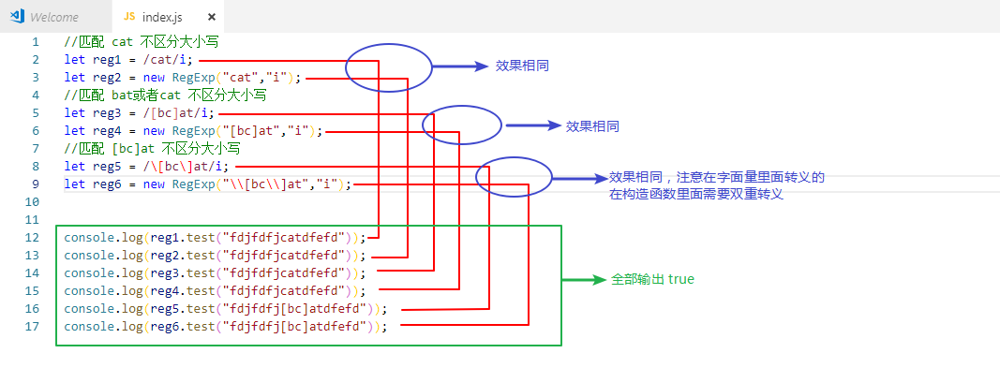
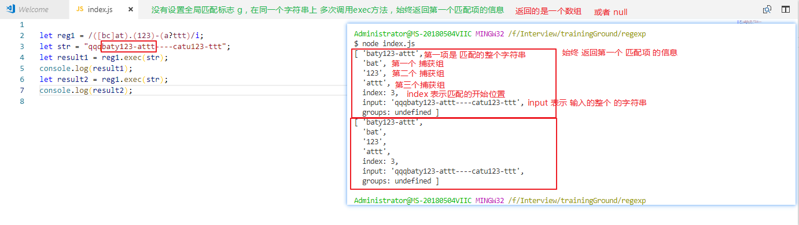
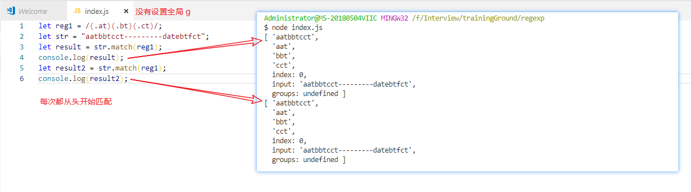
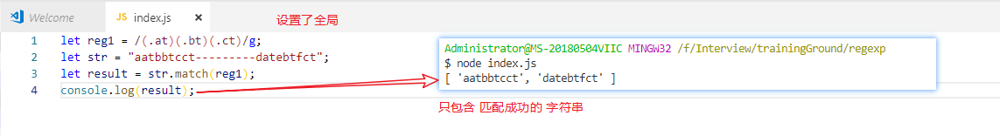
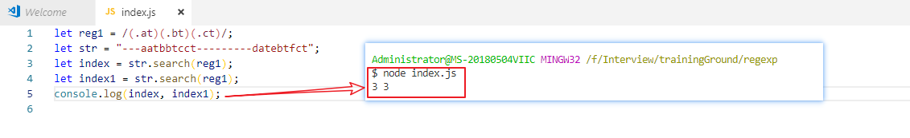
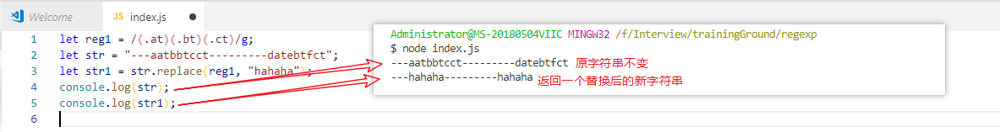

# js 正则表达式

### js 中的原字符： 

* `() [] {} \ ^ $ | ? * + .` 这些原字符在正则表达式中都有一种或者多种特殊用途，所以如果想要匹配字符串中包含的这些字符，必须进行转义用 `\`
* 在 [] 中需要转的有：`- \ []` ，像 `? + * ^ $ () {} ` 在中括号中都不需要转，`-`只有在[] 里面才是原字符，故不在[]里面 `-`可以不用转
* () : 分组
* [] : 表示匹配 其中的任何一个字符
* ？：匹配前面的字符 **0 次 或者 1 次**，相当于{0,1}
* `+` : 匹配前面字符 **1 次 或 多次**，相当于{1,}
* `*` : 匹配前面字符 **0 次 或 多次**，相当于{0,}
* **{n}** 重复n次
* **{n,}** 重复n次或者大于n次
* **{n,m}** 重复n到m次
* `^` : 匹配以什么**开头**
* `$` : 匹配以什么**结尾**
* `.` : 匹配除了换行符之外的任意字符
* **\d** 匹配0-9的数字,相当于[0-9]
* **\D** 匹配除了0-9的任意字符
* **\w** 匹配0-9、a-z、A-Z、_ 的数字或字符,相当于[0-9a-zA-Z_]
* **\W** 匹配不是字母、数字、下划线的字符

### 创建正则表达式的两种方式 :

* 字面量方式：

  * ```
    let reg1 = /cat/g;  //全局匹配 cat
    let reg2 = /[bc]at/g;  //全局匹配 cat 或者 bat
    let reg3 = /\[bc\]at/g;  //全局匹配 [bc]at
    ```

* 利用 RegExp 构造函数方式：

  * ```
    let reg1 = new RegExp("cat","g");  //全局匹配 cat
    let reg2 = new RegExp("[bc]at","g");  //全局匹配 cat 或者 bat
    let reg3 = new RegExp("\\[bc\\]at","g");  //全局匹配 [bc]at
    ```

  

### reg.exec(str) 方法介绍：

   * 一个正则去调用 exec 方法，传入一个字符串为参数，会去匹配该字符串中是否有与正则表达式相匹配的项，如果没有则返回 null，如果有则返回一个 数组（该数组的第一个元素为匹配成功的字符串，后面接着的是各个匹配组，此外这个数组有额外的两个属性：index 表示匹配的开始位置，input 表示输入的整个字符串，下图这个数组的length还是 4 ）
* 不加全局修饰符 g  每次匹配完 ， 在 reg1 上的 lastIndex 属性都是 0
  
* 加上全局修饰符 g 每次匹配完，在 reg1 上的 lastIndex 属性会增加（直至最后匹配不上时变为 0）
  

### reg.test(str) 方法介绍：
  * 正则表达式的第二个方法 test，该方法会检查字符串是否与给定的正则相匹配，如果是则返回 true，如果不匹配则返回 false
### 访问捕获组
  * 在 exec 方法掉用后，返回的数组从第二个参数开始 是 捕获组
  * 在调用 exec 或者 test 后 也可以这样去访问捕获组 `RegExp.$1 ...... RegExp.$9` 可以访问到 9 个捕获组

面试今日头条的笔试题：

从一个日期字符串中提取数字

```javascript
let str = "2018-10-07T11:48:47 Asia/zh-cn";

function fn (str) {
  let reg = /(\d{4})-(\d{2})-(\d{2}).(\d{2}):(\d{2}):(\d{2})/g;
  reg.exec(str);
  return [RegExp.$1, RegExp.$2, RegExp.$3, RegExp.$4, RegExp.$5, RegExp.$6];
}
// or 
function fn (str) {
  let reg = /(\d{4})-(\d{2})-(\d{2}).(\d{2}):(\d{2}):(\d{2})/g;
  return reg.exec(str).slice(1);
}
console.log(fn(str)); //[ '2018', '10', '07', '11', '48', '47' ]
```

### String 上面和正则相关的方法

#### str.match(reg)

* 这个 方法是通过 str 去调用的，传入的是一个 正则表达式，在没有全局标志 g 的时候：每次都从头开始匹配，返回的值和 exec 方法返回的一模一样（要么是一个null 要么是一个数组（第一项为匹配成功的自从，后面紧跟的是捕获组，也有 index 和 input ）），在有全局标志 g 的时候： 这里和 exec 是不一样的，这里返回的数组（包含所有匹配成功的字符串，不再包含 index 和 input）
* 
* 

#### str.search(reg)

* 这个方法也是通过 str 去调用的，传入的是一个 正则表达式，特点：
  * 返回的是字符串中第一个匹配项的 索引，如果不匹配则返回 -1
  * 并且始终从开头开始匹配



#### str.replace(reg，str)

* 这个方法也是通过 str 去调用的，传入的是一个 正则表达式和 一个字符串或者一个每次匹配都要调用的回调函数，特点：
* 返回一个替换后的字符串，原字符串不变
* 如果第一个是一个字符串，则只会替换字符串中第一次出现的子串
* 要想全局替换：必须第一个参数传一个正则表达式，并且设置 全局 g



- 如果第二个参数传入一个 函数

```javascript
let str = 'require("a.js"); require("b.js")';
let result = str.replace(/(require)\("(\w*\.{1}js)"\)/ig, (match,p1, p2) => {
    // 正则如果指定了g 每次匹配成功 都会运行这个函数
    console.log('match', match); // match 是每次匹配上的全部
    console.log('p1', p1); // 后面的依次是捕获组
    console.log('p2', p2);
    return `__webpack_require__("${p2}")`; // 返回值用于替换正则的内容
});
console.log(result);// __webpack_require__("a.js"); __webpack_require__("b.js")
```

- 替换模板字符串
```javascript
let str = "<% name >, 你好";
let obj = { name: "zhangsan" };
function fn(str, obj) {
    return str.replace(/<%(.+)>/g, (m, p) => obj[p.trim()]);
}
console.log(fn(str,obj));// zhangsan, 你好
```

