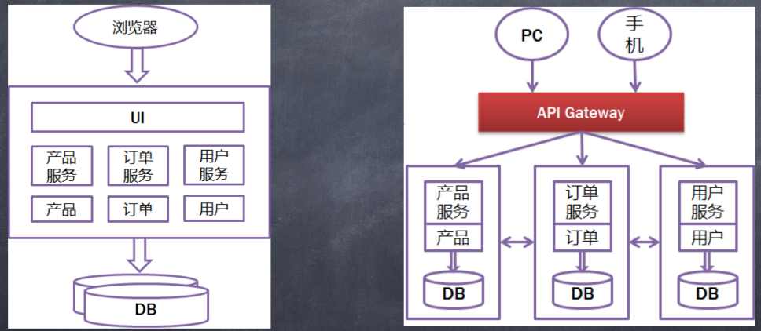
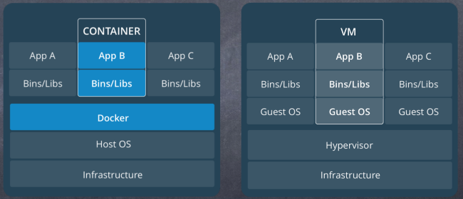
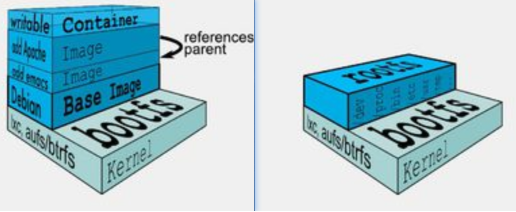

# 微服务 和 docker

### 微服务是什么？
> 微服务属于架构层面的设计模式
> 微服务的设计概念以业务功能为主 
> 微服务独立提供对应的业务功能 
> 微服务不拘泥于具体的实现语言
> 微服务架构 ≈ 模块化开发 + 分布式计算

### 单体服务 和 微服务对比



### 微服务特点

> 小, 且专注于做一件事情、处于独立的进程中、轻量级的通信机制、松耦合、独立部署

### 什么情况适用于微服务

> 业务复杂度高 团队规模大 业务需要长期演进 最后——没有银弹

### 微服务集成与部署

> 持续集成——jenkins、虚拟化——虚拟机、容器——Docker

### docker 介绍

> Docker是一个开源的引擎，可以轻松的为任何应用创建一个轻量级的、可移植的、 自给自足的容器。开发者在笔记本上编译测试通过的容器可以批量地在生产环境中 部署，包括VMs(虚拟机)、bare metal、OpenStack 集群和其他的基础应用平台

Docker通常用于如下场景:

> web应用的自动化打包和发布;自动化测试和持续集成、发布; 在服务型环境中部署和调整数据库或其他的后台应用; 从头编译或者扩展现有的OpenShift或Cloud Foundry平台来搭建自己的PaaS环境

### docker 和 vm 对比



- VM: 运行在宿主机之上的完整的操作系统、 运行自身操作系统会占用较多的资源

- Docker:Docker更加轻量高效、对系统资源的利用率很高 、比虚拟机技术更为轻便、快捷、隔离效果不如VM

### docker 相关概念

Docker是CS架构，主要有两个概念:
- Docker daemon（Docker守护进程）:
  运行在宿主机上
  用户通过Docker client(Docker命令)与Docker daemon交互
- Docker client:
  Docker 命令行工具，是用户使用Docker的主要方式 Docker client与Docker daemon通信并将结果返回给用户，Docker client也可以通过socket或者RESTful api访问远程的 Docker daemon



### Dockerfile

一个 Dockerfile 例子：这里是以python的例子，也可以用node来做

```shell
FROM centos
MAINTAINER xxx <xxx@qq.com>

RUN yum install gcc automake autoconf libtool make -y
RUN yum install zlib zlib-devel libffi-devel -y
RUN yum install wget -y
RUN wget https://www.python.org/ftp/python/3.7.0/Python-3.7.0.tgz
RUN tar -zxvf Python-3.7.0.tgz
WORKDIR Python-3.7.0

RUN ./configure
RUN ls -al
RUN make && make install

CMD python3 -m http.server
```

安装docker：`yum install docker`

启动，查看 docker 守护进程：`systemctl start docker systemctl status docker`

**镜像是静态的，容器是动态的，容器是镜像的一个实例，打包后的东西叫镜像，跑起来叫容器**