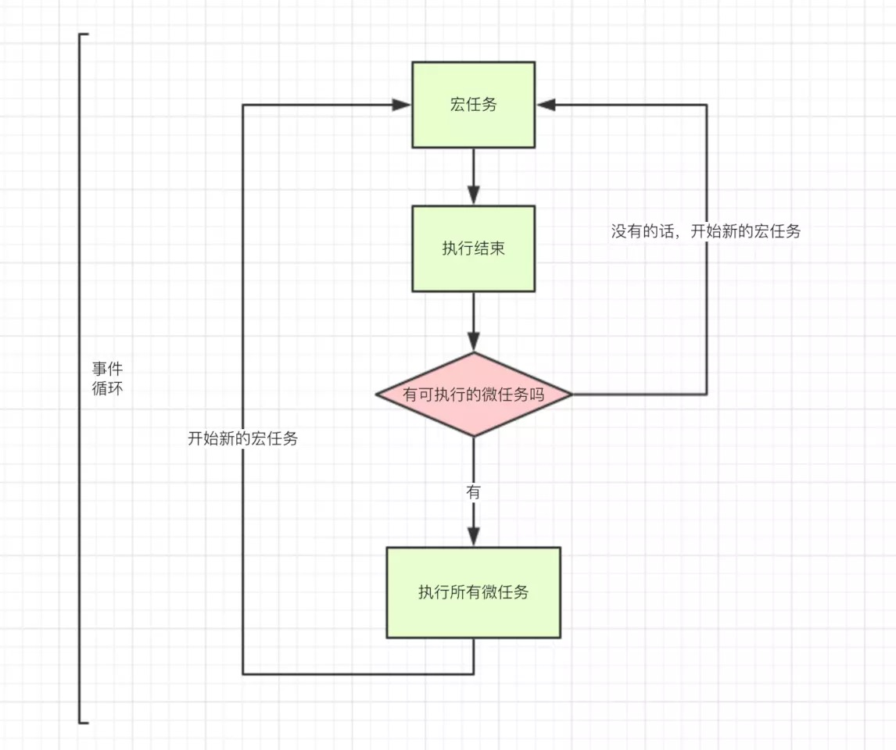

# eventLoop for browser

> js 里面执行的代码分为**同步任务(Synchronous)**和**异步执行队列(Asynchronous)**，异步执行队列又细分为**宏任务（macroTask）队列**和**微任务（microTask）队列**
>
> 在浏览器中，我们讨论事件循环，是以“从**宏任务队列**中取一个任务执行，再取出**微任务队列**中的所有任务来执行”来分析执行代码的。进入整体代码(宏任务)后，开始第一次循环。接着执行所有的微任务。然后再执行下一个宏任务(按照**添加的先后顺序**进行执行)，再执行所有的微任务
>
> 浏览器环境 **macro-task(宏任务)**：包括**整体代码script**，**setTimeout**，**setInterval**， **I/O**（ajax），**UI rendering**—————setImmediate 属于 node.js
>
> 浏览器环境 **micro-task(微任务)**：**Promises**， **Object.observe(已经废弃)**， **MutationObserver**--------------process.nextTick属于 node.js

* 异步队列需要等待主进程为空（即没有同步代码需要执行了），就去执行异步队列，所以，主线程中要执行的同步代码时间过长，会阻塞事件循环的执行，也就会阻塞异步操作的执行

Eventloop 流程：事件循环的顺序，决定js代码的执行顺序。进入整体代码(宏任务)后，开始第一次循环。接着执行所有的微任务。然后再执行下一个宏任务(按照**添加的先后顺序**进行执行)，再执行所有的微任务

1. **执行一段代码（一个 script 标签）**—这是一个macro-task，event-loop start，执行完所有的同步代码，主线程空闲
2. 去执行所有的 微任务（microTask）队列
3. 一次eventloop结束
4. 再去macroTasks 队列抽取一个任务，执行
5. 去执行所有的 微任务（microTask）队列
6. 又一次eventloop结束

notes：macroTask被套在 其他宏任务或者微任务里面时，要搞清楚宏任务被添加到macroTask异步执行队列的**顺序**，事件循环会按照这个顺序进行（重要）

microTask被套在 其他宏任务时相当于在当前tick立即执行

microTask被套在 其他microTask时相当于在当前tick立即执行



### setTimeout

`setTimeout`这个函数，是经过指定时间后，把要执行的任务加入到Event Queue中，又因为是单线程任务要一个一个执行，如果前面的任务需要的时间太久，那么只能等着，导致真正的延迟时间远远大于指定时间。

`setTimeout(fn,0)`这样的代码，0秒后执行？可以立即执行？

答案是不会的，`setTimeout(fn,0)`的含义是，指定某个任务在主线程最早可得的空闲时间就加入队列，意思就是不用再等多少秒了，只要主线程执行栈内的同步任务全部执行完成，栈为空就马上加入队列去执行

### setInterval

`setInterval`会每隔指定的时间将注册的函数置入Event Queue，如果前面的任务耗时太久，那么同样需要等待

对于`setInterval(fn,ms)`来说，我们已经知道不是每过`ms`秒会执行一次`fn`，而是每过`ms`秒，会有`fn`进入Event Queue。一旦**setInterval的回调函数fn执行时间超过了延迟时间ms，那么就完全看不出来有时间间隔了**。

```javascript
setTimeout(_ => console.log(4))

new Promise(resolve => {
  resolve()
  console.log(1)
}).then(_ => {
  console.log(3)
  Promise.resolve().then(_ => {
    console.log('before timeout')
  }).then(_ => {
    Promise.resolve().then(_ => {
      console.log('also before timeout')
    })
  })
})

console.log(2)
```

输出：

```
1
2
3
before timeout
also before timeout
4
```

再看一个复杂的（带嵌套的）

```javascript
console.log('1');

setTimeout(function() {
    console.log('2');
    setTimeout(function() {
        console.log('100');
    })
    Promise.resolve().then(function() {
        console.log('3');
        setTimeout(function() {
            console.log('200');
        })
    })
    new Promise(function(resolve) {
        console.log('4');
        resolve();
    }).then(function() {
        console.log('5')
        Promise.resolve().then(() => {
            console.log('5+');
            Promise.resolve().then(function() {
                console.log('5++')
                Promise.resolve().then(function() {
                    console.log('5+++')
                    Promise.resolve().then(() => {
                        console.log('5++++')
                    })
                })
            })

        })
    })
})
Promise.resolve().then(() => {
    console.log('9');
})
new Promise(function(resolve) {
    console.log('7');
    resolve();
}).then(function() {
    console.log('8')
})

setTimeout(function() {
    console.log('9');
    Promise.resolve().then(function() {
        console.log('10');
    })
    new Promise(function(resolve) {
        console.log('11');
        resolve();
    }).then(function() {
        console.log('12')
    })
    setTimeout(function() {
        console.log('300');
    })
})
```

输出：

```
1
7
9
8
2
4
3
5
5+
5++
5+++
5++++
9
11
10
12
100
200
300
```

继续：

```javascript
setTimeout(function() {
　　console.log(1);
}, 0);

console.log(2);

let end = Date.now() + 1000*5;

while (Date.now() < end) {
}

console.log(3);

end = Date.now() + 1000*5;

while (Date.now() < end) {
}

console.log(4);
```

输出：(说明了：异步代码是在所有同步代码执行完毕以后才开始执行的)

```
2
3
4
1
```