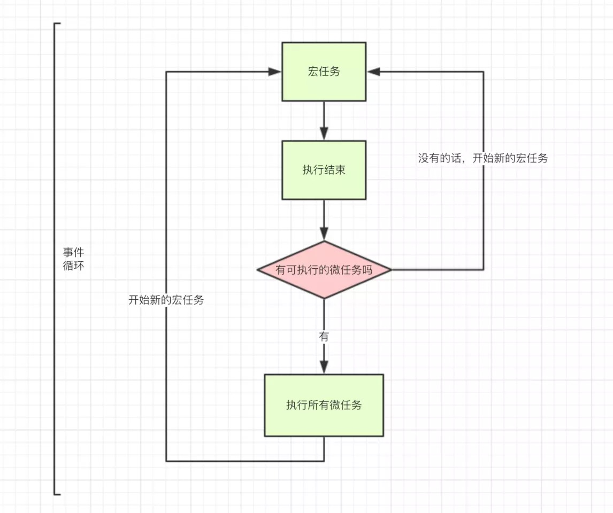

# eventLoop - node

> js 里面执行的代码分为**同步任务**和**异步执行队列**，异步执行队列又细分为**宏任务（macroTask）**和**微任务（microTask）**

- macro-task(宏任务)：包括**整体代码script**，**setTimeout**，**setInterval**， **setImmediate**， **I/O**

- micro-task(微任务)：Promise，process.nextTick

不同类型的任务会进入对应的Event Queue：

* macro-task 会进入 宏任务的 异步执行队列
* micro-task 会进入 微任务的 异步执行队列

> 事件循环的顺序，决定js代码的执行顺序。进入整体代码(宏任务)后，开始第一次循环。接着执行所有的微任务。然后再执行下一个宏任务(按照**添加的先后顺序**进行执行)，再执行所有的微任务
>
> macroTask被套在 其他宏任务或者微任务里面时，要搞清楚宏任务被添加到macroTask异步执行队列的**顺序**，事件循环会按照这个顺序进行（重要）
>
> microTask被套在 其他宏任务时相当于，注册微任务（将microTask添加到microTask的异步执行队列）
>
> microTask被套在 其他microTask时相当于立即执行



看一个例子：

```javascript
setTimeout(_ => console.log(4))

new Promise(resolve => {
  resolve()
  console.log(1)
}).then(_ => {
  console.log(3)
  Promise.resolve().then(_ => {
    console.log('before timeout')
  }).then(_ => {
    Promise.resolve().then(_ => {
      console.log('also before timeout')
    })
  })
})

console.log(2)
```

输出：

```
1
2
3
before timeout
also before timeout
4
```

再看一个：

```javascript
console.log('1');

setTimeout(function() {
    console.log('2');
    setTimeout(function() {
        console.log('100');
    })
    process.nextTick(function() {
        console.log('3');
        setTimeout(function() {
            console.log('200');
        })
    })
    new Promise(function(resolve) {
        console.log('4');
        resolve();
    }).then(function() {
        console.log('5')
        Promise.resolve().then(() => {
            console.log('5+');
            process.nextTick(function() {
                console.log('5++')
                process.nextTick(function() {
                    console.log('5+++')
                    Promise.resolve().then(() => {
                        console.log('5++++')
                    })
                })
            })

        })
    })
})
process.nextTick(function() {
    console.log('6');
})
new Promise(function(resolve) {
    console.log('7');
    resolve();
}).then(function() {
    console.log('8')
})

setTimeout(function() {
    console.log('9');
    process.nextTick(function() {
        console.log('10');
    })
    new Promise(function(resolve) {
        console.log('11');
        resolve();
    }).then(function() {
        console.log('12')
    })
    setTimeout(function() {
        console.log('300');
    })
})
```

输出：

```
1
7
6
8
2
4
3
5
5+
5++
5+++
5++++
9
11
10
12
100
200
300
```

