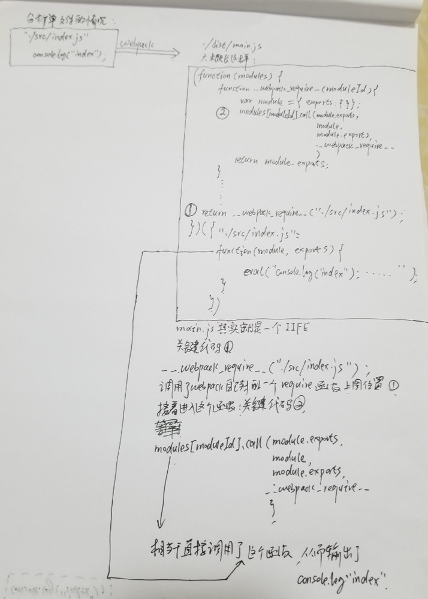
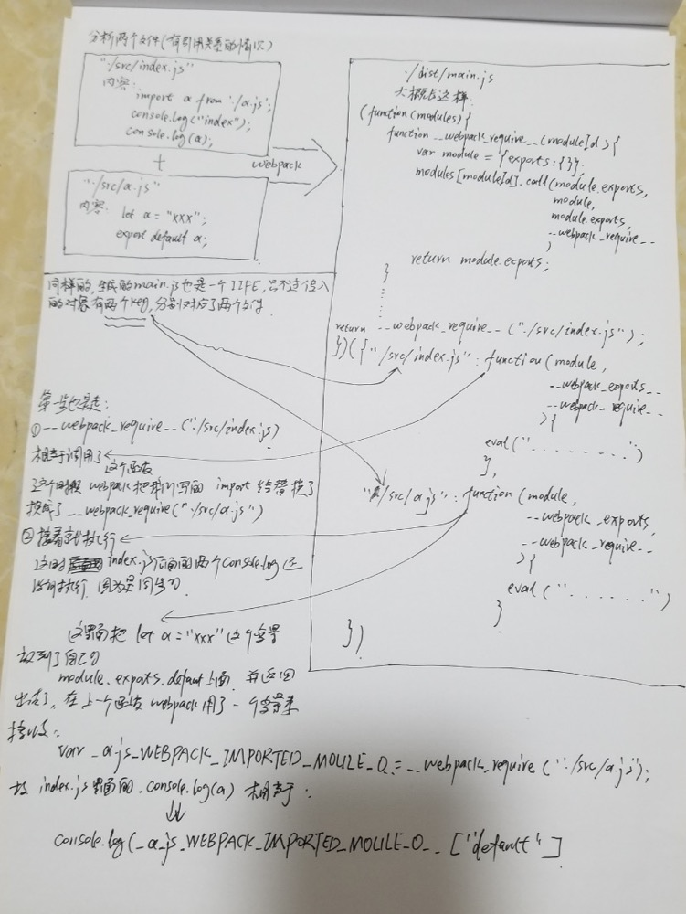

# webpack 机制

首先我们安装webpack：`sudo npm install webpack webpack-cli --save-dev`

接着我们在 `./src/index.js`里面写下一点点东西 `console.log('000');`

再接着我们写一个`package.json`命令来启动`webpack`：

```javascript
  "scripts": {
    "dev": "webpack --mode development"
  },
```

连 `webpack.config.js`我们都不需要，就完成上述配置，我们就可以用命令`npm run dev`打包了，会打一个 `dist/main.js`出来，我们去分析一下这个`main.js`，删掉注释该文件大概长这样：

```javascript
(function (modules) {
... ...
})({
    "./src/index.js":
      (function (module, exports) {
        eval("console.log('000');\n\n//# sourceURL=webpack:///./src/index.js?");
      })
  });
```

其实就是一个 立即执行函数，传入了一个对象： `./src/index.js` 作为`key`，一个函数作为值的对象

```
{
    "./src/index.js":
      (function (module, exports) {
        eval("console.log('000');\n\n//# sourceURL=webpack:///./src/index.js?");
      })
  }
```

完整的main.js:

```javascript
(function (modules) {
    var installedModules = {};
  
    function __webpack_require__(moduleId) {
      if (installedModules[moduleId]) {
        return installedModules[moduleId].exports;
      }
      var module = installedModules[moduleId] = {
        i: moduleId,
        l: false,
        exports: {}
      };
      // 这一句是关键，去执行了传入的对象的函数
      modules[moduleId].call(module.exports, module, module.exports, __webpack_require__);
  
      module.l = true;
      return module.exports;
    }
  
    __webpack_require__.m = modules;
  
    __webpack_require__.c = installedModules;
  
    __webpack_require__.d = function (exports, name, getter) {
      if (!__webpack_require__.o(exports, name)) {
        Object.defineProperty(exports, name, { enumerable: true, get: getter });
      }
    };
  
    __webpack_require__.r = function (exports) {
      if (typeof Symbol !== 'undefined' && Symbol.toStringTag) {
        Object.defineProperty(exports, Symbol.toStringTag, { value: 'Module' });
      }
      Object.defineProperty(exports, '__esModule', { value: true });
    };
  
    __webpack_require__.t = function (value, mode) {
      if (mode & 1) value = __webpack_require__(value);
      if (mode & 8) return value;
      if ((mode & 4) && typeof value === 'object' && value && value.__esModule) return value;
      var ns = Object.create(null);
      __webpack_require__.r(ns);
      Object.defineProperty(ns, 'default', { enumerable: true, value: value });
      if (mode & 2 && typeof value != 'string') for (var key in value) __webpack_require__.d(ns, key, function (key) { return value[key]; }.bind(null, key));
      return ns;
    };
  
    __webpack_require__.n = function (module) {
      var getter = module && module.__esModule ?
        function getDefault() { return module['default']; } :
        function getModuleExports() { return module; };
      __webpack_require__.d(getter, 'a', getter);
      return getter;
    };
  
    __webpack_require__.o = function (object, property) { return Object.prototype.hasOwnProperty.call(object, property); };
    __webpack_require__.p = "";
    return __webpack_require__(__webpack_require__.s = "./src/index.js");
  })({
      "./src/index.js":
        (function (module, exports) {
          eval("console.log('000');\n\n//# sourceURL=webpack:///./src/index.js?");
        })
    });
```

我们可以直接将上述代码copy到浏览器跑一下：不会报错，会输出一个 000

上面过程描述了只有一个文件的情况，如果我们在src再建立一个文件 test.js:

```javascript
let test = 'test';
export default test;
```
在index.js 里面引入 test.js：
```javascript
import test from './test.js';
console.log('----------000-----------');
console.log(test);
```
这个时候，我们再打包，会发现生成的 main.js 的立即执行函数传入的参数 有点不同：

```javascript
{
  "./src/index.js":
    (function (module, __webpack_exports__, __webpack_require__) {
      "use strict";
      eval("__webpack_require__.r(__webpack_exports__);\n/* harmony import */ var _test_js__WEBPACK_IMPORTED_MODULE_0__ = __webpack_require__(/*! ./test.js */ \"./src/test.js\");\n\nconsole.log('----------000-----------');\nconsole.log(_test_js__WEBPACK_IMPORTED_MODULE_0__[\"default\"]);\n\n//# sourceURL=webpack:///./src/index.js?");
    }),

  "./src/test.js":
    (function (module, __webpack_exports__, __webpack_require__) {
      "use strict";
      eval("__webpack_require__.r(__webpack_exports__);\nlet test = 'test';\n/* harmony default export */ __webpack_exports__[\"default\"] = (test);\n\n//# sourceURL=webpack:///./src/test.js?");
    })
}
```

我们发现我们写的  `import` 已经没有了，被webpack给我们换成了`__webpack_require__`

遇到 import 就换成 `__webpack_require__`, 遇到 export 就往 `module.exports` 上面挂，并且返回出去，上一个文件就能拿到结果，具体分析流程如下图



### 自己写一个打包单文件版本的 webpack

`./src/index1.js`: 我们的入口文件（等待被打包的文件）

```javascript
console.log('最简单的webpack');
```

`myWebpack.js` 我们写的简单版本  `webpack`

```javascript
const fs = require('fs');
const ejs = require('ejs');

let entryFile = './src/index1.js';
let outerFile = './dist/index1.js';

let entry = fs.readFileSync(entryFile, 'utf-8');
// 用 ejs 打一个模板，把 entry 注入 eval("<%- entry %>");
let result = ejs.render(`
(function (modules) {
    var installedModules = {};
  
    function __webpack_require__(moduleId) {
      if (installedModules[moduleId]) {
        return installedModules[moduleId].exports;
      }
      var module = installedModules[moduleId] = {
        i: moduleId,
        l: false,
        exports: {}
      };
      // 这一句是关键，去执行了传入的对象的函数
      modules[moduleId].call(module.exports, module, module.exports, __webpack_require__);
  
      module.l = true;
      return module.exports;
    }
  
    __webpack_require__.m = modules;
  
    __webpack_require__.c = installedModules;
  
    __webpack_require__.d = function (exports, name, getter) {
      if (!__webpack_require__.o(exports, name)) {
        Object.defineProperty(exports, name, { enumerable: true, get: getter });
      }
    };
  
    __webpack_require__.r = function (exports) {
      if (typeof Symbol !== 'undefined' && Symbol.toStringTag) {
        Object.defineProperty(exports, Symbol.toStringTag, { value: 'Module' });
      }
      Object.defineProperty(exports, '__esModule', { value: true });
    };
  
    __webpack_require__.t = function (value, mode) {
      if (mode & 1) value = __webpack_require__(value);
      if (mode & 8) return value;
      if ((mode & 4) && typeof value === 'object' && value && value.__esModule) return value;
      var ns = Object.create(null);
      __webpack_require__.r(ns);
      Object.defineProperty(ns, 'default', { enumerable: true, value: value });
      if (mode & 2 && typeof value != 'string') for (var key in value) __webpack_require__.d(ns, key, function (key) { return value[key]; }.bind(null, key));
      return ns;
    };
  
    __webpack_require__.n = function (module) {
      var getter = module && module.__esModule ?
        function getDefault() { return module['default']; } :
        function getModuleExports() { return module; };
      __webpack_require__.d(getter, 'a', getter);
      return getter;
    };
  
    __webpack_require__.o = function (object, property) { return Object.prototype.hasOwnProperty.call(object, property); };
    __webpack_require__.p = "";
    return __webpack_require__(__webpack_require__.s = "./src/index.js");
  })({
      "./src/index.js":
        (function (module, exports) {
          eval("<%- entry %>");
        })
    });
`, {
    entry
});

fs.writeFileSync(outerFile, result)
```

接着我们 运行 `node myWebpack.js`,就会 生成这个文件 `'./dist/index1.js'`,然后我们 copy 这里生成的代码 到浏览器一跑， 66的 输出了 `最简单的webpack`