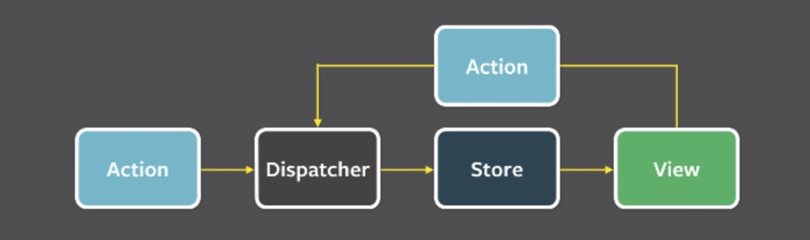
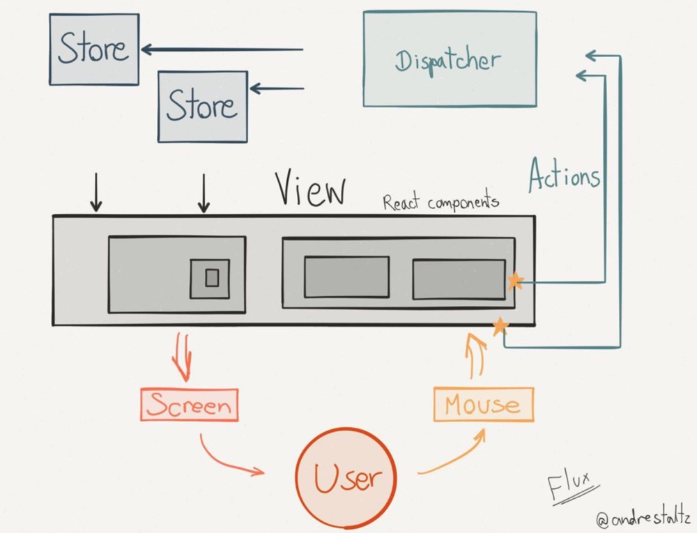

# redux

- Flux 是一种架构思想，专门解决软件的结构问题。它跟 MVC 架构是同一类东西，但是更加简单和清晰。

- 官方丢出一个思想，社区大量的出现了 flux 思想的实现，redux vuex mobx 等
- flux的思想规定：
  - View: 视图层
  - Action(动作):视图层发出的消息(比如mouseClick)
  - Dispatcher(派发器):用来接收Actions、执行回调函数
  - Store(数据层):用来存放应用的状态，一旦发生变动，就提醒Views要更新页面

### flux 架构

- 1.用户访问 View
- 2.View 发出用户的 Action
- 3.Dispatcher 收到 Action，要求 Store 进行相应的更新
- 4.Store 更新后，发出一个"change"事件
- 5.View 收到"change"事件后，更新页面

