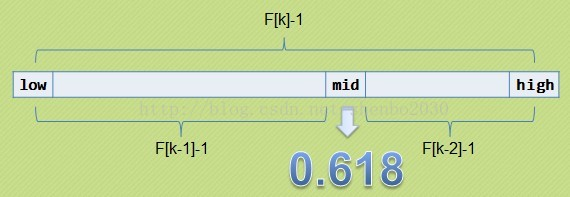

# Search algorithm

> **查找定义：**根据给定的某个值，在查找表中确定一个其关键字等于给定值的数据元素

> 1）静态查找和动态查找；
>
> 　　　　注：静态或者动态都是针对查找表而言的。动态表指查找表中有删除和插入操作的表。
>
> 2）无序查找和有序查找。
>
> 　　　　无序查找：被查找数列有序无序均可；
>
> 　　　　有序查找：被查找数列必须为有序数列。

#### 顺序查找

> 就是按照字面意思：按照顺序一个一个的比较，顺序查找一般针对被查找序列是无序的，是一种暴力查找

```javascript
function orderFind (arr, data) {
  let len = arr.length;
  for (let i = 0; i <= len - 1; i++) {
    if (data === arr[i]) return i;
  }
  return -1;
}
```

找最小值

```javascript
function findMin (arr) {
  let len = arr.length;
  let minIndex = 0;
  for (let i = 1; i <= len - 1; i++) {
    if (arr[i] < arr[minIndex]) {
      minIndex = i;
    }
  }
  return minIndex;
}
```

#### 二分查找-有序查找

> 针对已经去重、排序的列表，二分查找比顺序查找更加高效
>
> **折半查找的前提条件是需要有序表顺序存储，对于静态查找表，一次排序后不再变化，折半查找能得到不错的效率**

版本一：

```javascript
function binSearch1(arr, data) {
    let len = arr.length;
    let left = 0;
    let right = len - 1;
    while (left <= right) {
        // let mid = Math.trunc((left + right) / 2);
        let mid = left + right >> 1;
        if (arr[mid] < data) {
            left = mid + 1;
        } else if (arr[mid] > data) {
            right = mid - 1;
        } else {
            return mid
        }
    }
    return -1;
}
```

版本二（递归）：

```javascript
function binSearch2(arr, data, left, right) {
    let len = arr.length;
    left = left || 0;
    right = right || len - 1;
    let mid = Math.trunc((left + right) / 2);
    if ((mid === 0 || mid === len - 1) && arr[mid] !== data) {
        return -1;
    }
    if (arr[mid] === data) {
        return mid;
    } else if (arr[mid] > data) {
        return binSearch2(arr, data, left, mid - 1);
    } else {
        return binSearch2(arr, data, mid + 1, right);
    }
}
```

#### 插值查找-有序查找

> 首先考虑一个新问题，为什么上述算法一定要是折半，而不是折四分之一或者折更多呢？
>
> 打个比方，在英文字典里面查“apple”，你下意识翻开字典是翻前面的书页还是后面的书页呢？如果再让你查“zoo”，你又怎么查？很显然，这里你绝对不会是从中间开始查起，而是有一定目的的往前或往后翻。
>
> 同样的，比如要在取值范围1 ~ 10000 之间 100 个元素从小到大均匀分布的数组中查找5， 我们自然会考虑从数组下标较小的开始查找。
>
> mid=(low+high)/2, 即mid=low+1/2*(high-low);
>
> 通过类比，我们可以将查找的点改进为如下：
>
> mid=low+(key-a[low])/(a[high]-a[low])*(high-low)
>
> **基本思想：**基于二分查找算法，将查找点的选择改进为自适应选择，可以提高查找效率。当然，差值查找也属于有序查找。
>
> 　　注：**对于表长较大，而关键字分布又比较均匀的查找表来说，插值查找算法的平均性能比折半查找要好的多。反之，数组中如果分布非常不均匀，那么插值查找未必是很合适的选择。**
>
> 　　**复杂度分析：查找成功或者失败的时间复杂度均为O(log2(log2n))。**

```javascript
function InsertionSearch(arr, data) {
    let len = arr.length;
    let left = 0;
    let right = len - 1;
    if (arr[left] > data || arr[right] < data) {
        return -1;
    }
    while (left <= right) {
        // let mid = Math.trunc((left + right) / 2);
        // let mid = Math.trunc(left + (1 / 2) * (right - left));
        let mid = Math.trunc(left + (data - arr[left]) / (arr[right] - arr[left]) * (right - left));
        if (arr[mid] < data) {
            left = mid + 1;
        } else if (arr[mid] > data) {
            right = mid - 1;
        } else {
            return mid
        }
    }
    return -1;
}
```

#### 斐波那契查找

> 在介绍斐波那契查找算法之前，我们先介绍一下很它紧密相连并且大家都熟知的一个概念——黄金分割。
>
> 黄金比例又称黄金分割，是指事物各部分间一定的数学比例关系，即将整体一分为二，较大部分与较小部分之比等于整体与较大部分之比，其比值约为1:0.618或1.618:1。
>
> 0.618被公认为最具有审美意义的比例数字，这个数值的作用不仅仅体现在诸如绘画、雕塑、音乐、建筑等艺术领域，而且在管理、工程设计等方面也有着不可忽视的作用。因此被称为黄金分割。
>
> 大家记不记得斐波那契数列：1, 1, 2, 3, 5, 8, 13, 21, 34, 55, 89…….（从第三个数开始，后边每一个数都是前两个数的和）。然后我们会发现，随着斐波那契数列的递增，前后两个数的比值会越来越接近0.618，利用这个特性，我们就可以将黄金比例运用到查找技术中。

> 为了格式上的统一，以方便递归或者循环程序的编写。表中的数据是F(k)-1个，使用mid值进行分割又用掉一个，那么剩下F(k)-2个。正好分给两个子序列，每个子序列的个数分别是F(k-1)-1与F(k-2)-1个，格式上与之前是统一的。不然的话，每个子序列的元素个数有可能是F(k-1)，F(k-1)-1，F(k-2)，F(k-2)-1个，写程序会非常麻烦



```javascript
function fibonacciSearch(arr, data) {
    let n = arr.length;
    let left = 0;
    let right = n - 1;
    // 返回斐波那也固定 key 的值  [1,1,2,3,5,8,13,21,34, ... ]
    function fibonacci(k) {
        if (k === 0) return 1;
        if (k === 1) return 1;
        return fibonacci(k - 1) + fibonacci(k - 2);
    }
    let k = 0;
    while (true) {
        if (n < fibonacci(k)) {
            break;
        }
        k++;
    }
    // 补齐
    for (let i = n; i < fibonacci(k) - 1; i++) {
        arr[i] = arr[i - 1];
    }
    while (left <= right) {
        let mid = left + fibonacci(k - 1) - 1;
        if (data > arr[mid]) {
            left = mid + 1;
            k -= 2;
        } else if (data < arr[mid]) {
            right = mid - 1;
            k -= 1;
        } else {
            // 找到了，需要判断是数组本来的元素，还是我们补齐的元素
            arr.length = n; // 不修改原数组
            if (mid < n) {
                return mid; 
            } else {
                return n - 1;
            }
        }
    }
    arr.length = n; // 不修改原数组
    return -1;
}
let arr = [-99,-98,-90,-12,-5,-2,-1,0,1,2,3,4,5,6,7,8,10,11,12,111,123];
console.log(fibonacciSearch(arr, 0)); // 7
```

