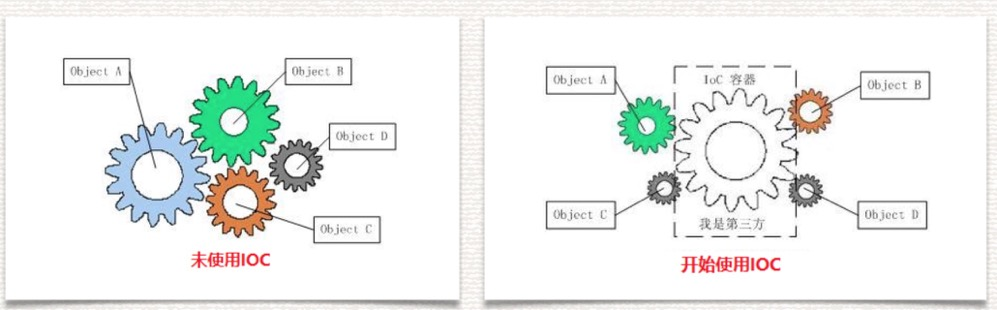

# 面向切面编程思想

solid 设计原则、ioc控制反转、di依赖注入、aop面向切面编程理论

### SOLID 原则

>  SOLID (单一功能原则、开闭原则、⾥里里⽒氏替换、接⼝口隔离以及依赖反转)

> **[S] Single Responsibility Principle (单一功能原则)**
>
> 单⼀一功能原则 :单⼀一功能原则 认为对象应该仅具有⼀一种单⼀一功能的概念。 换句句话说就是让⼀一个类只做⼀一种类型责任，当这个类需要承担其他类型的责任的时候，就需 要分解这个类。

>  **[O] Open Close Principle (开闭原则)**
>
> 开闭原则(ocp) 认为“软件体应该是对于扩展开放的，但是对于修改封闭的”的概念。 软件实体应该是可扩展，⽽而不不可修改的。也就是说，对扩展是开放的，⽽而对修改是封闭 的。

>  **[L] Liskov Substitution Principle(里氏替换原则)**
>
> ⾥氏替换原则 :里⽒替换原则 认为“程序中的对象应该是可以在不不改变程序正确性的前提下被它的子类所替换的”的概念。子类必须能够替换成它们的基类，也就是子类可以重写父类的虚方法

>  **[I] Interface Segregation Principle(接口隔离原则)**
>
> 接⼝口隔离原则 :接⼝口隔离原则 认为“多个特定客户端接⼝口要好于⼀一个宽泛⽤用途的接⼝口”的概念。 不不能强迫⽤用户去依赖那些他们不不使⽤用的接⼝口。换句句话说，使⽤用多个专⻔门的接⼝口⽐比使⽤用单⼀一的总接⼝口 总要好。

### 依赖注入(Dependency Injection)

> 为一个方法应该遵从“依赖于抽象⽽不是⼀个实例” 的概念。依赖注⼊入是该原则的一种实现⽅方式。值注⼊入、构造注⼊

### 控制反转(Inversion of Control)

控制反转(Inversion of Control，缩写为IoC)，是⾯面向对象编程中的 ⼀一种设计原则，可以⽤用来减低计算机代码之间的耦合度。其中最常⻅见 的⽅方式叫做依赖注⼊入(Dependency Injection，简称DI)

`ico`：叫控制反转，实现手段叫：`di`（依赖注入）

### ⾯向切面(Aspect Oriented Programming)

> 意为:面向切面编程，通过预编译方式和 运行期动态代理实现程序功能的统一维护的一种技 术。AOP是OOP的延续，是软件开发中的一个热 点，也是Spring框架中的⼀个重要内容，是函数式 编程的一种衍生范型。