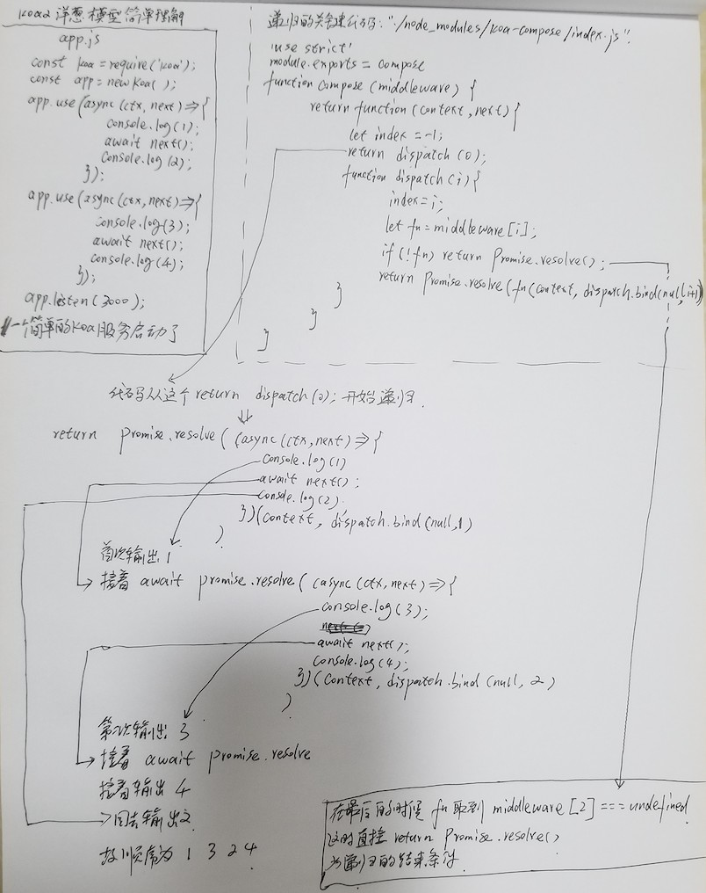

# KOA2 源码分析

安装 koa `npm install --save koa`

可以看见两个核心的文件夹📁：`koa` 和 `koa-compose`

- koa
  - lib
    - application.js
    - context.js
    - request.js
    - response.js

- koa-compose
  - index.js

最简单的启动koa应用的代码：

```javascript
const Koa = require('koa');
const app = new Koa();

app.use(async (ctx, next) => {
  console.log("1");
  await next();
  console.log("2");
});
app.use(async (ctx, next) => {
  console.log("3");
  ctx.body = 'Hello World';
  await next();
  console.log("4");
});

app.listen(3003);
```

跟随这个 `app.use`方法，我们打开 `./node_modules/koa/lib/application.js`找到对于的 `use` 方法：

`use`只是简单的将 函数 放到了 `this.middleware` 里面，`app.use` 就干了这么一件事

```javascript
  use(fn) {
    this.middleware.push(fn);
    return this;
  }
```

我们再看 `app.listen(3003)`：

直接调用的原生的 `http` 模块

```javascript
  listen(...args) {
    const server = http.createServer(this.callback());
    return server.listen(...args);
  }
```

再看 `this.callback`:

`this.callback` 调用了`compose` 传入了所有的中间件，返回了一个函数 `handleRequest`,因为原生的 `http.createServer`就需要传入一个 回调（请求进来了会调用这个函数）

```javascript
  callback() {
    const fn = compose(this.middleware);
    const handleRequest = (req, res) => {
      const ctx = this.createContext(req, res);
      return this.handleRequest(ctx, fn);
    };
    return handleRequest;
  }
```

这个时候我们跟踪到了 `./node_modules/koa-compose/index.js`:

```javascript
'use strict'
module.exports = compose
function compose (middleware) {
  return function (context, next) {
    let index = -1
    return dispatch(0)
    function dispatch (i) {
      if (i <= index) return Promise.reject(new Error('next() called multiple times'))
      index = i
      let fn = middleware[i]
      if (i === middleware.length) fn = next
      if (!fn) return Promise.resolve()
      try {
        return Promise.resolve(fn(context, dispatch.bind(null, i + 1)));
      } catch (err) {
        return Promise.reject(err)
      }
    }
  }
}
```

Koa 的源码是很少的，关键的代码也就那么几句，所以没有经过打包的，我们可以直接修改上面的 `./node_modules/koa-compose/index.js` 方便理解代码逻辑

具体分析如下图：



到现在为止，分析了重要的两个文件`application.js`、 `./node_modules/koa-compose/index.js`，还剩下：

- context.js
- request.js
- response.js

这三个是为相对独立的，为createContext服务的,创建上下文：

在 context 上挂了很多东西，方便我们用，比如： `context.req`、`context.res`

```javascript
  createContext(req, res) {
    const context = Object.create(this.context);
    const request = context.request = Object.create(this.request);
    const response = context.response = Object.create(this.response);
    context.app = request.app = response.app = this;
    context.req = request.req = response.req = req;
    context.res = request.res = response.res = res;
    request.ctx = response.ctx = context;
    request.response = response;
    response.request = request;
    context.originalUrl = request.originalUrl = req.url;
    context.state = {};
    return context;
  }
```

