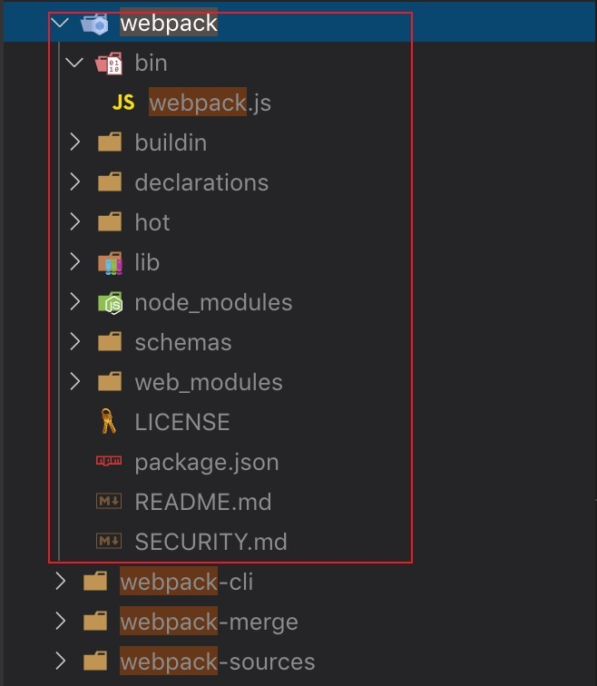

# webpack plugin

先看官网对 plugin 的描述：

> webpack **插件**是一个具有 [apply] 方法的 JavaScript 对象。`apply` 方法会被 webpack compiler 调用，并且 compiler 对象可在**整个**编译生命周期访问。

一个打日志的简单插件：**ConsoleLogOnBuildWebpackPlugin.js**:

```javascript
const pluginName = 'ConsoleLogOnBuildWebpackPlugin';

class ConsoleLogOnBuildWebpackPlugin {
  apply(compiler) {
    compiler.hooks.run.tap(pluginName, compilation => {
      console.log('webpack 构建过程开始！');
    });
  }
}
```

初次看到这个代码，是很懵的，apply方法为什么会被webpack compiler 调用？？？ compiler 又是什么鬼？？？

compiler.hooks.run.tap 这一串又是啥玩意？？？ 不懂

**先说结论：其实 apply 是留给 webpack 的口子，所有的插件 的 apply 方法会被 webpack compiler 调用，compiler是 webpack 调度的核心**

webpack 包目录结构：



里面的 `bin/webpack.js` 是命令行相关操作，我们知道安装webpack 我们得配套安装 webpack-cli，如果没有安装 webpack-cli ，在运行 webpack时会报错提示，这个提示就是在 `bin/webpack.js` 里面完成的