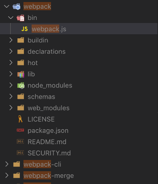

# webpack plugin

先看官网对 plugin 的描述：

> webpack **插件**是一个具有 [apply] 方法的 JavaScript 对象。`apply` 方法会被 webpack compiler 调用，并且 compiler 对象可在**整个**编译生命周期访问。

一个打日志的简单插件：**ConsoleLogOnBuildWebpackPlugin.js**:

```javascript
const pluginName = 'ConsoleLogOnBuildWebpackPlugin';

class ConsoleLogOnBuildWebpackPlugin {
  apply(compiler) {
    compiler.hooks.run.tap(pluginName, compilation => {
      console.log('webpack 构建过程开始！');
    });
  }
}
```

初次看到这个代码，是很懵的，apply方法为什么会被webpack compiler 调用？？？ compiler 又是什么鬼？？？

compiler.hooks.run.tap 这一串又是啥玩意？？？ 不懂

**先说结论：其实 apply 是留给 webpack 的口子，所有的插件 的 apply 方法会被 webpack compiler 调用，compiler是 webpack 调度的核心**

webpack 实现插件机制的大体流程：

1. 【创建】：webpack 在其内部对象上创建各种钩子；
2. 【组册】：插件将自己的方法注册到对应钩子上，交给webpack；
3. 【调用】：webpack编译过程中，会适时的触发相应钩子，因此也就触发了插件的方法；

webpack 包目录结构：



- 里面的 `bin/webpack.js` 是命令行相关操作（负责和用户交互的），我们知道安装webpack 我们得配套安装 webpack-cli，如果没有安装 webpack-cli ，在运行 webpack时会报错提示，这个提示就是在 `bin/webpack.js` 里面完成的

- 在 webpack 自己的 package.json 里面有一个 `"main": "lib/webpack.js",`这个是真正干活的，开始调度所有的 webpack 文件，打开`lib/webpack.js`：能找到这样的代码 
```
const Compiler = require("./Compiler");
...
compiler = new Compiler(options.context);
```
就是这个 `Compiler`，所以说这个 `Compiler` 是整个 webpack 的核心，`Compiler` 负责了所有的调度，在这个文件`./Compiler.js`里面有这种代码：

  ```javascript
  		if (options.plugins && Array.isArray(options.plugins)) {
  			for (const plugin of options.plugins) {
  				if (typeof plugin === "function") {
  					plugin.call(compiler, compiler);
  				} else {
  					plugin.apply(compiler);
  				}
  			}
  		}
  ```

- 这就清楚了**所有的插件 的 apply 方法会被 webpack compiler 调用，并传入了compiler ** 就是在这里干的

再看 `Compiler.js`,可以看到 compiler 的构造函数 给自己挂上了 `hooks.run`等一系列对象，回到文章开始的 `compiler.hooks.run.tap` 就能说通了

```javascript
const {
	Tapable,
	SyncHook,
	SyncBailHook,
	AsyncParallelHook,
	AsyncSeriesHook
} = require("tapable");
```

结合上下的代码：可以看出compiler.hooks.run是这个玩意：`new AsyncSeriesHook(["compiler"])`,是从`tapable`里面导出来的

```javascript
class Compiler extends Tapable {
	constructor(context) {
		super();
		this.hooks = {
			/** @type {SyncBailHook<Compilation>} */
			shouldEmit: new SyncBailHook(["compilation"]),
			/** @type {AsyncSeriesHook<Stats>} */
			done: new AsyncSeriesHook(["stats"]),
			/** @type {AsyncSeriesHook<>} */
			additionalPass: new AsyncSeriesHook([]),
			/** @type {AsyncSeriesHook<Compiler>} */
			beforeRun: new AsyncSeriesHook(["compiler"]),
			/** @type {AsyncSeriesHook<Compiler>} */
			run: new AsyncSeriesHook(["compiler"])
			...
```

可以看到 **Compiler Complilation 都是继承自Tapable**，并且Complilation 是Compiler.hooks的一个属性,这个**Tapable**就牛逼了，Compiler 这么牛逼的都要继承自你，Compiler 里面有Complilation，Complilation还得继承自你，Tapable 为啥这么有能耐。

Complilation: 

```javascript
class Compilation extends Tapable {
	/**
	 * Creates an instance of Compilation.
	 * @param {Compiler} compiler the compiler which created the compilation
	 */
	constructor(compiler) {
		super();
		this.hooks = {
			/** @type {SyncHook<Module>} */
			buildModule: new SyncHook(["module"]),
			/** @type {SyncHook<Module>} */
			rebuildModule: new SyncHook(["module"]),
      ...
```

`tapable`是 webpack 的东西，我们去 npm 上搜索一下这个包，映入眼帘的是：一堆 Hook

`tapable`就是一个事件分发的东西

```javascript
const {
    SyncHook,// 同步串行执行，不关心监听函数的返回值
    SyncBailHook,// 同步串行执行，只要有一个返回不为 null ，就跳过剩下的
    SyncWaterfallHook,
    SyncLoopHook,
    AsyncParallelHook,
    AsyncParallelBailHook,
    AsyncSeriesHook,
    AsyncSeriesBailHook,
    AsyncSeriesWaterfallHook 
 } = require("tapable");
```

玩一玩 tapable:

`sudo npm install tapable --save-dev`

`testTapAble.js` `node testTapAble.js`

```javascript
const {
    SyncHook,// 同步串行执行，不关心监听函数的返回值
    SyncBailHook,// 同步串行执行，只要有一个返回不为 null ，就跳过剩下的
    SyncWaterfallHook,
    SyncLoopHook,
    AsyncParallelHook,
    AsyncParallelBailHook,
    AsyncSeriesHook,
    AsyncSeriesBailHook,
    AsyncSeriesWaterfallHook 
 } = require("tapable");

let queue = new SyncHook(["name", "name2", "name3"]);
//订阅
queue.tap("1", function(name) {
    console.log(1, arguments);
    return 1;
})
queue.tap("2", function(name, name2) {
    console.log(2, arguments);
    return 2;
})
queue.call("webpack", "webpack-cli", "hhh3");
```

输出：

```javascript
1 [Arguments] { '0': 'webpack', '1': 'webpack-cli', '2': 'hhh3' }
2 [Arguments] { '0': 'webpack', '1': 'webpack-cli', '2': 'hhh3' }
```

上述代码将`let queue = new SyncHook(["name", "name2", "name3"]);` 替换为：`let queue = new SyncBailHook(["name", "name2", "name3"]);` 起结果：

```javascript
1 [Arguments] { '0': 'webpack', '1': 'webpack-cli', '2': 'hhh3' }
```

这些钩子